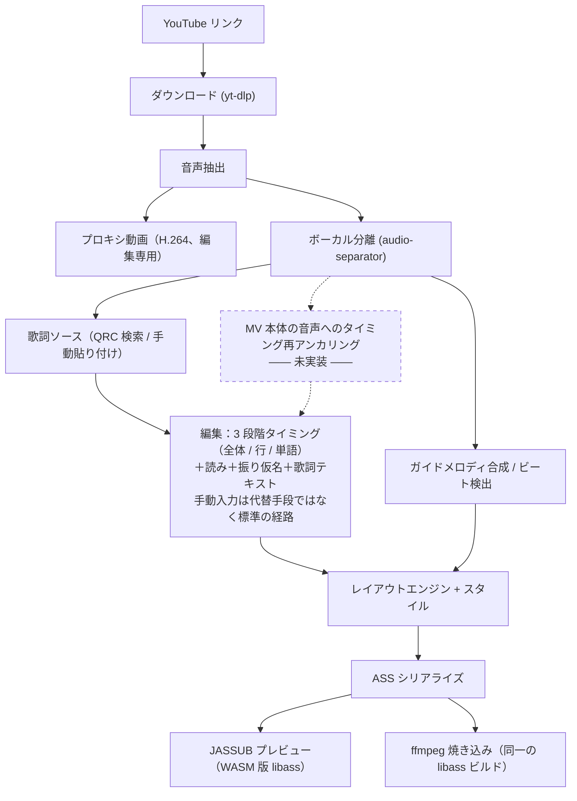

# Karaoke Video Maker（ニコカラメーカー）

[](LICENSE)

**言語:** [English](README.md) | [简体中文](README.zh-CN.md) | 日本語

YouTube のリンクを渡すと、一文字ずつ色が変わるカラオケ字幕・日本語の**振り仮名**・任意で
**オフボーカル**音声を備えたニコカラ動画が出来上がります。分離もタイミング合わせも読み推定も
すべて手元のマシンで完結し、クラウドの AI サービスには一切送信しません。


*実際に書き出した動画からの1コマ。縁取りの色も塗りと一緒に反転します（ASS の `\k` だけでは
できません）。ガイドドットは分離したドラム音源から検出した実際の拍に乗っています。*

## 必須の前提条件

手動で入れるのは 3 つだけ——[`uv`](https://docs.astral.sh/uv/)、**Node.js 18以上**（22 で確認）、
そして **libass 入りの ffmpeg**。残りはセットアップスクリプトが面倒を見ます。

- **ffmpeg は libass 入りであること。** Homebrew の主流 `ffmpeg` には libass が**含まれていません**
  ——macOS は `ffmpeg-full`、Windows は `--enable-libass` 付きの "full" / gyan.dev 系ビルドを。
  判定はバージョンではなく機能で行い、`ass` フィルターが登録されていなければそこで止まり、
  実行すべきコマンドを表示します。
- **macOS は Apple Silicon、または Windows x64。** Intel Mac は非対応（PyTorch が 2.2 以降
  Intel macOS を切っており、ボーカル分離がそれに依存）。Windows での実行実績はまだありません。
- **ボーカル分離の重みは初回利用時にダウンロード**されます（84MB〜640MB）。ただし黙って
  落とすことはありません。自己診断は不足を報告するだけで、一切ダウンロードしません。
  ガイドメロディの音高モデル（CREPE）は Python パッケージに同梱で、**実行時に通信しません**。
- **設計上クラウド AI は使いません。** 動画や歌詞テキストの取得は問題ありませんが、音声や歌詞を
  外部モデルへ送って推論させることは対象外です（`CLAUDE.md` §2.1）。

## セットアップと起動

```bash
python3 scripts/setup.py   # 自己診断のうえ Python 3.12・仮想環境・npm パッケージを導入
python3 scripts/dev.py     # もう一度診断し、問題がなければバックエンドとフロントを同時起動
```

`http://localhost:5173` を開いてください。Ctrl-C で両方とも綺麗に止まり、孤児プロセスは残りません。
どちらのスクリプトも標準ライブラリだけで書かれており、3.9 以上の任意の Python で動きます——
3.12 を導入すること自体が仕事なので、3.12 を前提にはできないからです。致命的な問題
（libass 無し・Intel Mac・ポート使用中）があれば**起動せず**、そのまま貼り付けられる対処
コマンドを表示します。任意の extra が欠けているだけなら警告のみで、失われる機能を明示します。

`setup.py --check-only` は導入せず診断だけ、`--minimal` は `torch` を入れない、`--json` は
機械可読。`dev.py --backend-port/--frontend-port` でポート変更。診断結果だけ欲しいときは
`PYTHONPATH=backend uv run python -m kvm.doctor --copy`（クリップボードにもコピー）。

### デスクトップアプリとしてビルド

```bash
python3 scripts/package.py   # フロントエンドのビルド → PyInstaller → Tauri
```

成果物は `src-tauri/target/release/bundle/` に出ます（macOS: 1.1 GB の `.app`、352 MB の `.dmg`）。
**ウィンドウがアプリそのもので、ブラウザを開く必要はありません。** 初回起動時に libass 入りの
ffmpeg を専用ディレクトリ（`~/.karaoke-video-maker/bin`）へ自動ダウンロードします。進捗表示あり、
SHA256 はコードに直書き、レジューム対応。アンインストールはそのディレクトリを消すだけです。
失敗した場合は起動画面に「何が足りないか / なぜか / どうすればよいか」が出ます（回り続けることはありません）。

ビルドは**署名なし**です。macOS では `.dmg` から入れたアプリの初回起動を Gatekeeper が止めます:
右クリック →「開く」→「開く」、または
`xattr -dr com.apple.quarantine "/Applications/Karaoke Video Maker.app"`。
Windows では SmartScreen の「詳細情報」→「実行」。自分でビルドした場合はどちらも出ません。

手動で動かす場合は `uv sync --all-extras` の後、
`uv run uvicorn --app-dir backend kvm.api.app:app` と `npm --prefix frontend run dev`。
どちらのサーバーも JASSUB が `SharedArrayBuffer` を使うのに必要な COOP/COEP ヘッダーを設定します。
起動時のフォントスキャンのため、「様式」は最初の30〜40秒「スキャン中…」と出ます。

> 編集画面の表示言語は**現時点では中国語のみ**です。文言はすべて `frontend/src/i18n/` の
> `t()` 経由になっていますが、日本語・英語のテーブルはまだ書かれていません。

## 最初の1本を作る

`http://localhost:5173` を開き、プロジェクトを作って5ステップを進みます。

| ステップ | やること |
|---|---|
| **1. 素材** | YouTube のリンクを貼るか、ローカルファイルを放り込みます。ボーカル分離も同じ画面から、品質は3段階。裏では編集用の低解像度プロキシ動画が作られるので、4K AV1 の素材でもシークがもたつきません。ガイドメロディもここで作ります——つまみは5つ、いじったその場で試聴できるので、焼き上げてから気づくことがありません。 |
| **2. 歌詞** | 歌詞ソースを検索するか、自分で貼り付け・インポートするか。この2つは対等な入口で、「本筋」と「代替手段」ではありません。候補には手元の動画との尺の差が出ます——正しいリリースとカバー・ライブ音源・41秒の試聴クリップを見分ける一番確かな手がかりです。粒度と振り仮名の有無は候補を開くまで「不明」表示です（検索 API が本当に把握していないため）。 |
| **3. 編集** | このツールの中心です。歌詞ソースの文字単位タイミングをそのまま使ってもよいし、ゼロから打っても構いません。0.5〜1.0倍速で再生しながら音節ごとに <kbd>スペース</kbd>、あとは境界のドラッグと矢印キー（±10ms、<kbd>Alt</kbd> 併用で ±1ms）。どのタイミングがどこ由来かは色で分かります。読み・振り仮名・歌詞テキストの書き換えも、すべてこの同じステージです。 |
| **4. 様式** | **フォントの優先順リスト**を組みます（先頭のフォントに無い字は次のフォントが肩代わり）。数百の OS 導入フォントを和名・英名どちらでも検索できます。サイズ・縁取り・影は画面高さに対する割合で指定します（1080p でも 4K でも同じ見え方）。パートごとに4色——未歌唱の塗りと縁、歌唱済みの塗りと縁——を割り当てます。縁取りも塗りと一緒に反転するためです。プレビューは完成画面そのものの libass 実レンダリングで、背景は黒・緑・白に切り替えられます。 |
| **5. 導出** | 音声（原曲かオフボーカルか）と、ガイドメロディを混ぜるかどうかを選びます。プレビューでも実際に鳴るので、チェックを入れるのは賭けではありません。数分かかる焼き込みの前に、「要所」バーがプレビューを一番あやしい箇所へ飛ばします——歌い出し、各パートの頭、制作クレジット、一番長い行、振り仮名が一番詰まった行、ラスト。 |

| | |
|---|---|
|  |  |
|  |  |

### コマンドラインから作る

インポート済みの QRC 歌詞とダウンロード済みの動画から、焼き込み済み MP4 を直接出力します。
`--ass-only` は焼き込みを省いてスタイル調整を秒で回せ、`--start`/`--duration` は一部だけ、
`--audio` は伴奏に差し替えてオフボーカル版、`--guide-vocals` はガイドメロディ。一覧は `--help`。

```bash
uv run --python 3.12 --with numpy --with "librosa>=0.11" --with "numba>=0.61" \
  python backend/kvm/pipeline/make_video.py \
  --video  workspace/media/<動画>.mkv --out workspace/out/output.mp4 \
  --parsed workspace/qrc/qrc_parsed.json --kana workspace/qrc/kana_entries.json \
  --drums  "workspace/sep_full/<曲名>_(Drums)_htdemucs.flac"
```

ボーカル分離だけを回す場合——`onnxruntime` は明示指定が必要です（`audio-separator` は自動で
連れてきません）:

```bash
uv run --python 3.12 --with audio-separator --with onnxruntime audio-separator \
  workspace/media/audio_44k.wav --model_filename htdemucs.yaml \
  --model_file_dir workspace/models --output_dir workspace/sep_full
```

## アーキテクチャ概要

**唯一の正データはプロジェクトファイルで、ASS ではありません。** ASS はプレビューと書き出しの
たびに生成される出力先で、読み戻すことはありません。自動生成された値はすべて
`(value, source, locked)` を持ち、再実行はロックされていないフィールドしか書き換えません——
手で合わせたサビが消えないのはこのためです。詳細は [`docs/architecture.md`](docs/architecture.md)（英語）。



## まだ実装されていないもの

コードを読んで確認した内容です。動く部分も含めた全体像は [`docs/status.md`](docs/status.md)（英語）。

- **強制アライメント / CTC 自動タイミング**——ありません。タイミングは QRC 由来か手動のみです。
- **自動の読み生成**——形態素解析はありません。振り仮名は QRC のかな軌道か手入力だけです。
- **タイミングの再アンカリング**——歌詞ソースは商業音源のマスターに合っており MV の音声とは
  ずれますが、自動補正はなく、耳で合わせる全体オフセットのつまみが1つあるだけです。
- **QQ音楽以外の歌詞ソース**——酷狗、網易雲音楽、LRCLIB、UtaTen、YouTube 公式字幕はいずれも
  調査済みですが、本番にはまだ1つも組み込まれていません。
- **パートの自動判別**と、メイン/コーラスに分ける2段目の分離——**コーラス入りはまだ作れません**。
- **依存関係を代わりに落としてくること**——`python -m kvm.doctor` による診断と
  `scripts/setup.py` による Python・npm 側の導入はありますが、ffmpeg は検出のみで自動導入はしません。
- **フォントの同梱**——OS 導入済みのフォントから選ぶだけです（優先順リスト全体の字形
  カバレッジ検査はレンダリング前に行われ、どの字をどのフォントが描くかも表示されます）。
- **日本語/英語のUI**、および **Windows** での実行実績。

## ライセンスと法的な注意

**MIT** です（[`LICENSE`](LICENSE)）。インストーラーに同梱される第三者のものはすべて
[`THIRD-PARTY-NOTICES.md`](THIRD-PARTY-NOTICES.md) に記載しています。JASSUB と、その wasm に
組み込まれている libass / FreeType / HarfBuzz / FriBidi、付属のフォールバックフォント
Liberation Sans（SIL OFL 1.1）、および Python・npm 双方の依存パッケージ群です。

- 設計上想定している強制アライメントモデル（`MMS_FA` の重み）は **CC-BY-NC 4.0、非商用限定**
  です。この制限はコードではなく**モデル側**のものです。まだ接続されていませんが、接続した
  場合は**モデルを差し替えない限り、その重みを使ったビルドと、そこから書き出した動画は
  商用利用できません**。
- QRC 復号は公開されている定数情報から独自に書いたもので、GPL コードベースのコピーではない
  ため、コピーレフトの義務は本プロジェクトに及びません。
- 動画・音声のダウンロードや歌詞の取得は各プラットフォームの利用規約と著作権の制約を受け、
  もともと無い権利が生じるわけではありません。これは法的助言ではありません。

## 関連ドキュメント

- [`docs/architecture.md`](docs/architecture.md)（英語）——ASS が一方向である理由、ロックの仕組み。
- [`docs/status.md`](docs/status.md)（英語）——コードで確認した機能の現状。
- [`docs/ui-redesign.md`](docs/ui-redesign.md)——フロントエンドの情報設計仕様（中国語）。
- `CLAUDE.md`——開発契約書（中国語）。長く濃密ですが、本プロジェクトが実際に依拠する情報源です。
- スクリーンショットはスクリプト生成です。両サーバー起動中に `node frontend/scripts/shot-readme.mjs [名前]`。
