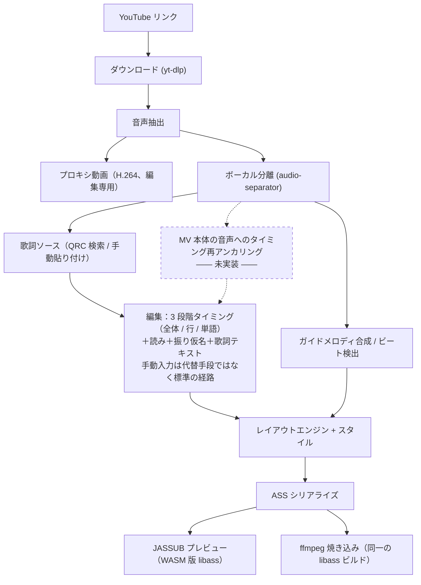

# Karaoke Video Maker（ニコカラメーカー）

**言語:** [English](README.md) | [简体中文](README.zh-CN.md) | 日本語

**完全ローカル動作**のオールインワン・ニコカラ（ニコニコ動画風カラオケ）動画制作ツールです。
YouTube のリンクを渡すだけで、**一文字ずつ色が変わるカラオケ字幕**、日本語の**振り仮名**、
そして任意で **ONボーカル / OFFボーカルの2音声トラック**を備えた動画が出来上がります。
ボーカル抜き・タイミング合わせ・読み推定など、推論処理はすべて自分のマシン上で完結し、
クラウドの AI サービスには一切送信しません。


*実際に書き出した動画からの1コマ。歌っている部分だけ青く変わり、漢字の上には振り仮名、
それ以外は白のまま——いわゆる「ニコカラ」の定番の見た目です。**縁取りの色も塗りと一緒に
反転している**点にご注目ください。ASS の `\k` タグだけでは実現できない挙動です。*


*間奏が明ける直前。3つの点が右から左へ1つずつ消えていき、最後の1つが消えると同時に
歌い出しになります。この点は分離したドラム音源から検出した実際の拍に乗せてあります——
等間隔に並べた点はそれらしく見えても、歌う側は合わせられません。*

---

## このリポジトリの現在地

開発途中のプロジェクトですが、**設計書だけの段階ではありません**。`backend/kvm/` 以下には
実際に動く **FastAPI バックエンド**が、`frontend/src/` 以下には実際に使える
**React + TypeScript 製の編集画面**があります。具体的に、現時点で次のことができます。

- `yt-dlp` で動画を取得（YouTube。Bilibili は実験的対応）、またはローカルファイルを取り込み
- `audio-separator` によるローカルでのボーカル分離（3段階の品質を選択可能）。あわせて
  軽量な H.264 プロキシ動画を自動生成するので、4K AV1 の素材でもシークがもたつきません
- QQ音楽（QQ Music）を検索して一文字単位・振り仮名付きの QRC 歌詞ソースを取得、
  または歌詞を手動で貼り付け/インポート（プレーンテキスト / LRC / QRC）
- 波形を見ながら行・単語単位でタイミングを詰める。タップ入力、境界のドラッグ（隣の
  文字と連動させることも可能）、全体オフセットの微調整、行や単語の分割・結合。すべて
  元に戻す/やり直しに対応し、項目ごとにロックできるため、手で合わせたタイミングが
  あとの自動処理で勝手に上書きされることはありません
- 文字区間ごとに振り仮名を編集。各区間には「この読みはどこから来たか」を示す出典バッジが
  付きます。歌詞ソースの表記が間違っているときは、行の歌詞そのものをその場で書き換えられ、
  タイミングがどれだけ引き継げたかも書き換え後に表示されます
- OS にインストール済みのフォントから選択し、フォントサイズ・縁取り・影を画面高さに
  対する割合で指定、パートごとに4色の配色を割り当て——しかもそれらを
  **完成画面そのものの libass による実レンダリング**で確認できます（CSS による見た目の
  模倣ではありません）
- 字幕焼き込み済みの MP4 を書き出し。任意で OFFボーカル音声や合成ガイドメロディを
  選べます。出来上がったファイルはブラウザからそのままダウンロードできます

リポジトリ直下の `CLAUDE.md` は本プロジェクトの開発契約書であり、そこで描かれている
目標アーキテクチャは現状よりかなり大きいものです（強制アライメント、形態素解析ベースの
自動読み生成、複数歌詞ソース対応、環境セルフチェック、依存関係の自動取得など）。
その一部はすでに実装済みですが、まだのものもあります。下の「**プロジェクトの現状**」は
コードを実際に読んで確認した、誇張のない一覧です——機能が存在すると思い込む前に、
まずそちらをご覧ください。

| | |
|---|---|
|  |  |
| **編集**ステップ——波形と一文字ごとのタイムライン、タイミング出典の色分け | **編集**ステップ——同じ歌詞を、今度は読みの側から見たところ |

タイミングと振り仮名は、あえて2つではなく**1つのステップ**にまとめてあります。どちらも
選んだ同じ単語を別の角度から直す作業（いつ歌うか／どう読むか）であり、しかも振り仮名を
独立したステップにすると再生手段がなくなります——読みは耳で確かめるしかないのに、です。

---

## 必須の前提条件（インストール前に必ず確認してください）

ここを飛ばすと、原因がわかりにくい形でアプリが動かなくなります。先に確認してください。

1. **ffmpeg は libass 入りでなければならず、判定は「バージョン番号」ではなく
   「機能があるかどうか」で行います。** Homebrew の主流の `ffmpeg` フォーミュラには
   libass が**含まれていません**。macOS では `ffmpeg-full`、Windows では
   `--enable-libass` 付きの "full" / gyan.dev 系ビルドが必要です。次のコマンドで確認します。

   ```bash
   ffmpeg -h filter=ass
   ```

   `Unknown filter 'ass'` のような出力が出た場合、その ffmpeg は字幕焼き込みができず、
   `ffmpeg -version` の表示バージョンがどれだけ新しくても以降の処理は動きません。
   このマシンでは `brew install ffmpeg-full` で ffmpeg 8.1.2 が入り、`ass` フィルタが
   登録済みであることを本 README 作成時に実機で確認しています。

2. **Python 3.12（[`uv`](https://docs.astral.sh/uv/) で管理）。** 本プロジェクトは
   `requires-python = ">=3.12,<3.13"` に固定されています。OS 付属の Python で無理に
   動かそうとしないでください。`uv python install 3.12` を使えば、システムの Python に
   触れずに固定バージョンのインタプリタが手に入ります。

3. **Node.js**（18以上推奨。開発・動作確認は Node 22 / npm 10 で実施）。フロントエンド用です。

4. **モデルの重みは初回利用時にダウンロードされ、リポジトリには同梱されていません。**
   ボーカル分離モデルは高速モデルの約84MBから最高品質モデルの約640MBまで幅があり、
   ガイドメロディ用の音高推定モデル（CREPE）も選ぶバリエーションによって2〜89MBです。
   モデルが必要な機能を初めて使うと、その場でダウンロードが始まって処理が一時停止します
   ——これはフリーズではなく想定通りの動作ですが、その瞬間だけはネットワーク接続が必要です
   （それ以外の工程はオフラインで動作可能です）。

5. **macOS は Apple Silicon（arm64）のみ対応、Intel Mac は非対応です。** PyTorch は
   2.2 以降 Intel macOS のサポートを打ち切っており、ボーカル分離機能がこれに依存しています。
   Windows では x64 で NVIDIA GPU（CUDA）または CPU のみのどちらでも動作しますが、
   速度は大きく変わります。

6. **設計上、クラウド AI は一切使用しません。** ソース動画・音声のダウンロードや歌詞
   テキストの取得（＝データを取ってくること）はよいのですが、音声や歌詞を外部の
   モデルへ送って推論させることは、本プロジェクトの方針として明確に対象外です
   （`CLAUDE.md` §2.1 参照）。本リポジトリを検討している方は、「クラウド高速化オプション」
   のようなものは存在しない（追加もしない）前提でご覧ください。

---

## セットアップ

リポジトリをクローンしたら、リポジトリのルートで次を実行します。

```bash
# Python ツールチェイン（バックエンド）
uv python install 3.12
uv sync --extra api --extra fonts --extra audio --extra separate --extra download --extra lyrics

# Node ツールチェイン（フロントエンド）
cd frontend && npm install && cd ..
```

依存関係は意図的にグループ分けされています。出力までの中核パイプラインは軽量で、
`torch` を使う分離処理や `librosa` を使う音声解析のような重い依存は、実際にその機能を
使う場合のみ導入されます。`--extra` を何も付けずに `uv sync` すると、すでに用意済みの
素材からレンダリングパイプラインを動かせる最小限の構成になります。

### バックエンドの起動

```bash
uv run uvicorn --app-dir backend kvm.api.app:app --host 127.0.0.1 --port 8000 --reload
```

（インポート可能なパッケージがトップレベルの `kvm/` ではなく `backend/kvm/` にあるため、
`--app-dir backend` が必須です。これは本機の開発サーバーが実際に使っている起動コマンド
そのままです。）起動時にはバックグラウンドでシステムフォントのスキャンも開始します
（フォント数の多いマシンでは30〜40秒程度かかることがあります）。編集画面の「様式
（スタイル）」ステップは、スキャンが終わるまで「スキャン中…」と表示され、リクエスト
自体がブロックされることはありません。

バックエンドは `GET /api/health` を提供し、フロントエンドの libass ベースのプレビューア
（JASSUB）が `SharedArrayBuffer` を使うために必要な COOP/COEP ヘッダーも併せて設定します。

### フロントエンドの起動

```bash
cd frontend
npm run dev
```

これで Vite が `http://localhost:5173` で起動します（COOP/COEP ヘッダーは設定済み）。
起動前には JASSUB の worker/wasm アセットを `public/` にコピーします（`predev` フック）。
このアドレスを開くとまずプロジェクト一覧画面が表示されます（新規プロジェクト作成、または
既存プロジェクトを開く）。


編集画面は5ステップで構成されています。
**素材 → 歌詞 → 編集 → 様式（スタイル）→ 導出（書き出し）**。
各ステップは中央のメイン領域全体を、そのステップに本当に必要な形で使います——編集なら
波形とタイムライン、スタイルなら完成画面そのもの——「動画プレイヤー＋タイムライン」の
固定レイアウトではありません。再生機能は編集ステージだけが持つため、「同じ画面に再生
ボタンが2つある」という状態は構造上起こりません。

> 編集画面の表示言語は**現時点では中国語のみ**です。`frontend/src/i18n/` には i18n の
> 抽象化レイヤーがすでにあり（画面上の文字列はすべて `t()` 関数経由で取得しています）、
> 日本語・英語の文言テーブルはまだ用意されていません。アプリ内の言語切り替え機能もありません。
> 中国語が読めない場合は、5つのステップアイコンと本 README のスクリーンショットが
> 現時点で一番の頼りになります。

---

## 最初の1本を作る

### 画面から作る（推奨）

**1. 素材。** プロジェクトを新規作成し、YouTube リンクを貼り付けて（またはローカルの
動画・音声ファイルを放り込んで）ダウンロードを待ちます。ボーカル分離も同じ画面から——
品質を選んで実行するだけです。手元に揃った音源（原曲ミックス、ボーカル、伴奏、ドラム）は
それぞれ波形と再生ボタン付きのカードになり、裏では編集用の低解像度プロキシ動画が
生成されます。


**2. 歌詞。** 歌詞ソースを検索するか、自分で貼り付け・インポートするか。この2つは
**対等な入口**であって、「本筋」と「代替手段」ではありません。検索結果には各候補と
手元の動画との尺の差が出ます。これが、正しいリリースとカバー・ライブ音源・41秒の
試聴クリップを見分ける一番確かな手がかりになります。粒度と振り仮名の有無は、候補を
実際に開くまで「不明」と表示されます——検索 API が本当に把握していないからです。
右側のプレビューが、一文字単位のタイミングと仮名トラックが本当に付いてくるのかを
確定させる場所であり、確認してから採用を決められます。


**3. 編集。** このツールの中心です。歌詞ソースが持っていた文字単位のタイミングを
そのまま使ってもよいし、自分でゼロから打ってもかまいません。0.5〜1.0倍速で再生しながら
音節ごとに <kbd>スペース</kbd> を叩き（タップ入力）、あとは境界のドラッグ、矢印キーでの
微調整（±10ms、<kbd>Alt</kbd> 併用で ±1ms）、行や単語の分割・結合で詰めていきます。
どのタイミングがどこから来たのかは色で分かります——未入力、歌詞ソース由来、補間による
推定値、手動で確定してロック済み。読みも振り仮名も、そして歌詞ソースの表記が違っていた
ときの歌詞そのものの書き換えも、すべてこの同じステージで行います。

**4. 様式（スタイル）。** フォントを選び、サイズ・縁取り・影を画面高さに対する割合で
指定し（同じスタイルが 1080p でも 4K でも同じ見え方になります）、パートごとに4色——
未歌唱の塗りと縁、歌唱済みの塗りと縁——を割り当てます。4色必要なのは、色が変わって
いくときに縁取りも塗りと一緒に反転するからです。左側のプレビューは完成画面そのものの
libass による実レンダリングで、背景を黒・緑・白に切り替えて、どんな映像の上でも
縁取りが負けないかを確かめられます。


**5. 導出（書き出し）。** 音声（原曲か伴奏か）と、ガイドメロディを混ぜるかどうかを選んで
書き出します。数分かかる焼き込みに入る前に、下部の「要所」バーがプレビューを一番あやしい
箇所へ飛ばしてくれます——歌い出し、各パートの頭、制作クレジット、一番長い行、振り仮名が
一番詰まっている行、そしてラスト。書き出し済みのファイルはサイズと尺付きで一覧に並び、
そのままブラウザからダウンロードできます。


### コマンドラインから作る（画面なしでレンダリング/スタイルのコードを反復検証するときに便利）

CLI は、すでにインポート済みの QRC 歌詞（QRC インポートパイプラインが生成する
`qrc_parsed.json` と `kana_entries.json`）とダウンロード済みの動画を受け取り、
字幕焼き込み済みの MP4 を直接出力します。

```bash
uv run --python 3.12 --with numpy --with "librosa>=0.11" --with "numba>=0.61" \
  python backend/kvm/pipeline/make_video.py \
  --video   workspace/media/<動画ファイル>.mkv \
  --parsed  workspace/qrc/qrc_parsed.json \
  --kana    workspace/qrc/kana_entries.json \
  --drums   "workspace/sep_full/<曲名>_(Drums)_htdemucs.flac" \
  --out     workspace/out/output.mp4
```

主なオプション（すべて `--help` の出力で実機確認済み）: `--ass-only` は ASS ファイルのみ
生成し、スタイル調整を秒単位で繰り返せます。`--start` / `--duration` は試し出力用の短い
区間だけをレンダリングします。`--audio` は伴奏トラックに差し替えて OFFボーカル版を出力
します。`--guide-vocals` はガイドメロディを合成して混ぜ込みます（`--guide-timbre`、
`--guide-gain` などで音色・音量を調整可能）。`--offset-ms` は全体のタイミングオフセット
です。最新かつ完全な一覧は `python backend/kvm/pipeline/make_video.py --help` を実行して
確認してください——パイプラインは日々変化するため、この README のオプション一覧は
目安であり、常に最新とは限りません。

CLI からのボーカル分離:

```bash
uv run --python 3.12 --with audio-separator --with onnxruntime audio-separator \
  workspace/media/audio_44k.wav --model_filename htdemucs.yaml \
  --model_file_dir workspace/sep_probe/models --output_dir workspace/sep_full
```
（`audio-separator` は `onnxruntime` を自動では連れてこないため、明示的に指定しないと
分離処理が import エラーで失敗します。）

---

## アーキテクチャ概要

**唯一の正データはプロジェクトファイルであり、ASS 字幕ファイルではありません。** ASS は
プレビューや書き出しのたびにプロジェクトのデータモデルから毎回新しく生成される
「出力先」であり、逆に ASS を読み込んでプロジェクトに反映することは一切行いません。
これは重要な点です。下記の各工程は「手動でロックされていないフィールドだけを上書きする」
という前提で設計されており、もし ASS を双方向に読み書きしていたら、この保証は
維持できなくなります。



図中の点線で囲んだ部分が、**現時点で唯一まだ存在しない工程**です（下の「プロジェクトの
現状」を参照）。それ以外はすべて、今日そのまま動かせるコードです。

いくつか特筆すべき設計上の判断です。

- **「オールインワン」は付加価値ではなく、絶対に譲らない製品要件です。** このパイプラインの
  どのステップにも、「ここから先は Aegisub でやってください」という想定はありません。
  自動化された各工程（ダウンロード、歌詞取得、タイミング合わせ、読み推定、行分割、
  段落検出）には同じ画面内に必ず手動の代替手段があり、自動処理が失敗してもパイプライン
  全体を止めるのではなく機能を落として続行します。
- **自動生成された値はすべて `(value, source, locked)` の3つ組を持ちます。** 自動処理を
  再実行しても `locked = false` のフィールドしか書き換えません。これにより、「アライメント
  を再実行したのに、手で合わせたサビのタイミングはまったく変わっていない」という状態が、
  ドキュメント上の約束ではなくコード（`backend/kvm/editing/ops.py`）によって強制されています。
- **内部の時間はすべてミリ秒単位**です。ASS の `\k`（センチ秒）はシリアライズする瞬間にだけ
  生まれ、しかも「個々の長さを別々に四捨五入」するのではなく「累積タイムスタンプを
  四捨五入してから差分を取る」方式で計算しています。長い行の末尾でズレが積み重なるのを
  防ぐためです。
- プレビュー（libass の WASM ビルドである JASSUB）と書き出し（ffmpeg の `ass` フィルタ）は、
  **同一の** libass ビルドでレンダリングすることを前提としています。編集中に見た見た目が
  焼き込み後の成果物と一致するようにするためで、具体的にどう担保しているかは `CLAUDE.md`
  §5.12 に記載されています。

プロジェクトファイルのデータモデル、読みの優先順位のしくみ、ASS 生成のレイアウト
エンジン、これまでに実施した実験とその結論まで含めた完全なアーキテクチャは、
リポジトリ直下の `CLAUDE.md` を参照してください。あえて長く濃密に書かれており、
これは宣伝文句ではなく、本プロジェクトが実際に依拠している開発契約書です。

---

## プロジェクトの現状

このセクションは設計書の丸写しではなく、実際のコードを読んで確認した内容です。
両者が食い違う場合はコードを優先しています。

**実装済みで実際に動作するもの（本環境で実機確認済み）:**

- FastAPI バックエンド: プロジェクト管理API（元に戻す/やり直し・変更ごとの自動保存を含む）、
  歌詞の検索/プレビュー/適用/インポート、メディアのダウンロード/分離/プロキシ動画生成、
  編集操作（時間シフト/タイミング設定/ロック/振り仮名/行分割/行結合/パート指定）、
  ASS 生成 + 非同期の書き出しジョブ、システムフォントのスキャン/カバレッジ確認/サブセット化
- 5ステップ構成の React 製編集画面（素材/歌詞/編集/様式/導出）。プロジェクト一覧の
  ホーム画面、元に戻す/やり直し、そして各ステップがメイン領域全体を使う画面構成
  （「動画プレイヤー中心の固定レイアウト」ではない）。タイミングと振り仮名は当初
  別々のステップでしたが、現在は「**編集**」に統合されています
- 波形に合わせた手動タイミング入力（タップ入力）、境界のドラッグ（隣接トークンへの
  連動あり）、全体オフセットの微調整、行および単語の分割/結合、そして目に見える
  タイミング出典の色分け（未入力／歌詞ソース／自動アライメント／補間推定／手動＋ロック済み）
- 手動入力＋歌詞ソースに基づく振り仮名編集（各区間に出典バッジ表示）と、行の歌詞テキスト
  そのものの書き換え。既存のタイミング・読み・パート指定は可能な限り引き継ぎ、
  引き継げなかったものは一覧として提示されます
- yt-dlp による YouTube のダウンロード（Bilibili は実験的対応）。音質優先のストリーム選択、
  コンテナの開始オフセット検出
- `audio-separator` によるローカルのボーカル分離。独立したサブプロセスで実行し、
  JSON-lines 形式で進捗を報告、コンテンツハッシュでキャッシュ（API プロセス内では実行せず、
  バックエンドをブロックしない）
- 編集用プロキシ動画の生成——そのままではブラウザで再生できない素材（Matroska に入った
  4K AV1 など）を、短い GOP・音声なしの H.264/MP4 に変換します。**編集専用であり、
  書き出しには必ず元の素材を使います**
- 波形ピークのバックエンド事前計算（多段 LOD、BBC `audiowaveform` のバイナリ形式）と
  ffprobe ベースのメディア情報取得API。ブラウザ側で音源を丸ごとデコードする必要はありません
- QQ音楽の QRC 歌詞検索/取得。非標準（S-boxに誤植がある）な DES 復号処理を含み、
  公開されている定数情報をもとに Python で独自に再実装（サードパーティの復号コードは
  一切取り込んでいない）
- ASS の生成——2層構造＋漸進的な `\clip` によるカラオケの色変化（**塗りと縁取りが
  一緒に反転する**）、行ごとのフェードイン/アウト、行内でのパート別の色分け、
  中央に配置される制作クレジット画面、そして検出した拍に乗せたガイドドット
- ガイドメロディの合成（CREPE による音高抽出 → 中央値フィルタ → 音符分割 → 半音格子への
  量子化 → 帯域制限した倍音合成、伴奏に混入）と、ドラムステムに基づくビート検出
- ブラウザ上での libass による実プレビュー（JASSUB）。**書き出しで焼き込むものと同一の
  ASS** を読み込み、編集・様式・導出の3ステージで利用できます。システムフォントは
  サーバ側でサブセット化して配信するため、プレビューと書き出しで同じフォント名を使えます
- テスト350件がパス、1件スキップ（`uv run pytest -q`）
- ffmpeg の自動**検出**（バージョン番号ではなく機能で判定）。既知のインストール先を巡回

**設計済みだが未実装のもの——存在すると思い込まないでください:**

- **強制アライメント / CTC ベースの自動タイミング合わせ**——データモデルには
  `TimingSource.ALIGNED` が予約されていますが、現在のパイプラインでこの値を生成する処理は
  ありません。今のタイミングは QRC 由来か手動のいずれかのみです。MV本体の音声への
  再アンカリング実験（`experiments/reanchor_xcorr.py`）は単独スクリプトのままで、
  パイプラインには未接続です。
- **自動読み生成**（形態素解析、辞書引き、音響的な曖昧性解消）——`ReadingSource.MORPH` /
  `DICT` / `ACOUSTIC` は予約された列挙値であり、これらを生成する処理はまだありません。
  現在の振り仮名は QRC のかな軌道か手動入力のみに由来します。
- **他の歌詞ソースの追加**——酷狗（Kugou）、網易雲音楽（NetEase）、LRCLIB、UtaTen、
  YouTube 公式字幕はいずれも調査済みです（`CLAUDE.md` §5.2 と `experiments/` 配下の
  スクリプトを参照）が、本番用の `kvm.lyrics` パッケージに実際に組み込まれているのは
  QQ音楽のみです。
- **タイミングの再アンカリング**——歌詞ソースのタイミングは商業音源のマスターに
  合わせてあり、MV の音声に合わせたものではありませんが、これを自動で補正する処理は
  ありません。耳で合わせる全体オフセットのつまみ（`global_offset_ms`）が1つあるだけです。
- **話者/パートの自動判別（ダイアライゼーション）**——パートは現状、編集画面で
  手動指定するのみで、主唱/コーラスの自動検出機能はありません。ボーカルをさらに
  メインとコーラスに分ける2段目の分離も未実装のため、**コーラス入りの音源はまだ作れません**。
- **依存関係の自動取得**——ffmpeg は「すでにある場合に見つける」検出処理のみが実装済みで、
  自動ダウンロードしてアプリ専用ディレクトリにインストールする処理はまだありません。
  環境セルフチェックコマンド（`backend.doctor`）もまだ存在しません。ボーカル分離と
  yt-dlp だけは例外で、必要に応じてアプリ専用の環境へ自動で導入・更新されます。
- **フォントの同梱**——スタイルのステップでは OS にインストール済みのフォントから選択
  できますが、フォントファイル自体を同梱・自動取得することはありません。字形カバレッジ
  については**書き出し前に検査されます**：スタイルのステップで、選んだ書体がその曲の
  全文字（歌詞・振り仮名・クレジット画面）を覆えているかを表示し、書き出しのステップでも
  ボタンの直前でもう一度検査します。欠けている字形は警告であって、書き出しは止めません。
  逆方向のずれも別枠で報告します：アプリ内プレビューが libass に渡しているのは
  フォントの**サブセット**（ASCII・仮名・JIS X 0208 の漢字）なので、その範囲外の文字
  （`鷗`・`α`・`①`）はプレビューでは空白になりますが、焼き込んだ動画では正常に出ます。
- **発音形の読みの永続化**——プロジェクトのデータモデルと API には、表示用の振り仮名とは
  別に「実際にどう歌われるか」の読み（助詞の「は」→ ワ など）を持つ層があり、規則ベースで
  導出する API も用意されています。ただし編集画面はこの発音形をブラウザのローカル
  ストレージに保持したままで送信していないため、別のマシンに移ると失われます。この層が
  本当に効いてくるのは強制アライメントが入ってからであり、それ自体がまだ未実装です。
- **日本語/英語のUI**——前述の通り、編集画面は現在中国語のみです。i18n の仕組み自体は
  用意されていますが、翻訳文言はまだありません。
- **Windows** は本環境では検証されていません（開発・動作確認は macOS Apple Silicon 上での
  み実施）。アーキテクチャは `CLAUDE.md` §2.2 の通り両プラットフォームを目標にしていますが、
  本 README 作成者が確認できた範囲では、Windows 上で実際に動かした記録はまだありません。

特定の機能に依存するかどうかを判断する際は、この一覧や `CLAUDE.md` を鵜呑みにせず、
必ずコードを grep して確認してください——両方とも時間とともに古くなりますが、
コードだけは常に真実です。

---

## ライセンスと法的な注意事項

**このリポジトリには現時点で `LICENSE` ファイルがありません。** 本プロジェクトの
現在の公開方針（`CLAUDE.md` §3 参照）は「私的利用（自分専用）、公開するとしても
ソースコードが見える形のオープンソースまで——**ビルド済みバイナリの配布は行わない**」
というものです。ライセンスファイルが用意されるまでは、このコードをその前提で
扱ってください。

この方針に付随して、リポジトリを利用・参考にする際に知っておくとよい点をいくつか
挙げます。

- 一部のオプション依存関係は **GPL ライセンス**です（例: `pykakasi`、および本プロジェクトが
  あえて取り込んでいない一部の歌詞ソース参照実装——具体的に何を採用し、何を採用しなかったか
  は `CLAUDE.md` §3 / §6.1 を参照）。本プロジェクト自身の QRC 復号コードは、公開されている
  定数情報をもとに Python で独自に書かれたものであり、GPL コードベースからのコピーでは
  ありません。
- 本プロジェクトが設計上想定している強制アライメントモデル（`MMS_FA` /
  `ctc-forced-aligner` の重み）は **CC-BY-NC 4.0——非商用限定**です。現時点ではまだ
  パイプラインに接続されていません（上記「プロジェクトの現状」参照）が、もし将来接続
  される場合、そのモデルを別のものに差し替えない限り、**本プロジェクトおよびその成果物は
  商用利用できません**。
- **動画・音声のダウンロードや歌詞テキストの取得は、関係する各プラットフォーム
  （YouTube、QQ音楽など）の利用規約と著作権の制約を受けます。** 本ツールは、これらの
  プラットフォームが公開しているデータを個人の非商用利用のために自動取得するものであり、
  もともと持っていなかった権利を新たに付与するものではありません。利用方法についての
  責任は利用者ご自身にあります。これは法的助言ではありません。

---

## 関連ドキュメント

- リポジトリ直下の `CLAUDE.md`——完全な開発契約書です。データモデル、すべての技術選定と
  その理由、これまでに実施した実験とその結論、現在も検討中の未解決の課題までを網羅して
  います。長く濃密ですが、開発に関わる人にとって実際に依拠すべき情報源です。
- `docs/ui-redesign.md`——現行のフロントエンド情報設計の仕様書です（上記で説明した
  「5ステップのステージ型UI」はこの文書で定義されています）。

本 README のスクリーンショットはすべてスクリプトで生成しています。UI を変更したあとに、
先月のビルドの画面がドキュメントに残り続けることがないようにするためです。バックエンドと
フロントエンドの dev server が起動している状態で、次のコマンドで作り直せます。

```bash
node frontend/scripts/shot-readme.mjs          # すべて
node frontend/scripts/shot-readme.mjs step-style   # 1枚だけ撮り直す場合
```

データが最も揃っているプロジェクトを自動的にサンプルとして選び、ローカルのユーザー名が
写り込みかねない絶対パスを消したうえで、`pngquant` で圧縮します。完成動画の2コマだけは
`workspace/` に元動画と生成済みの `.ass` が必要で、無い場合はエラーにはならず
スキップされます。
