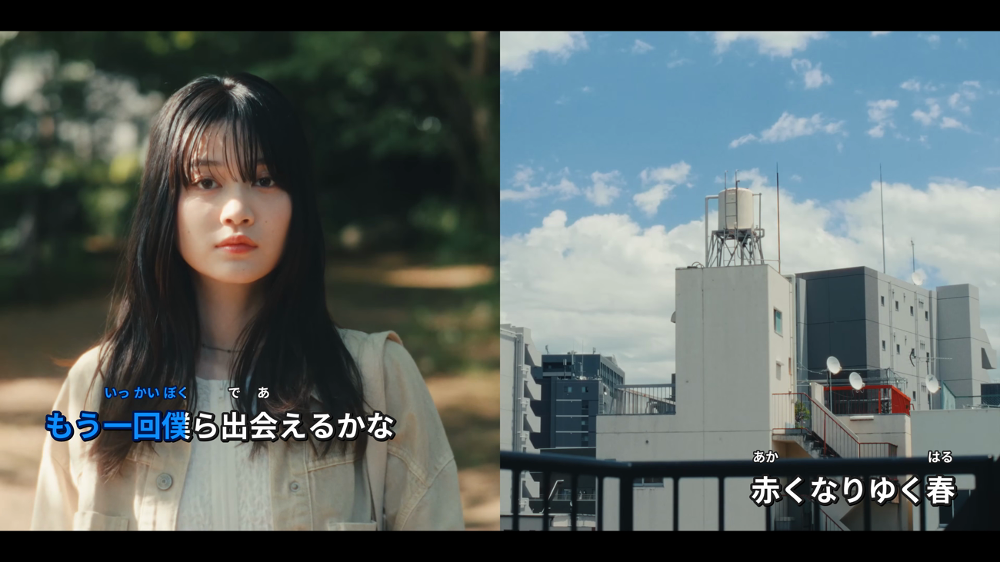
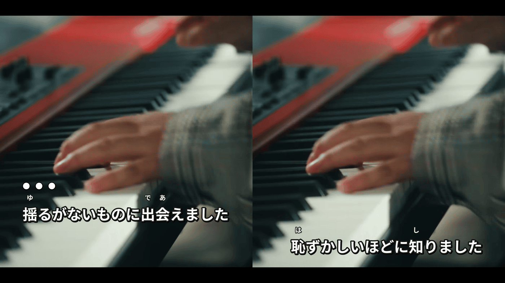
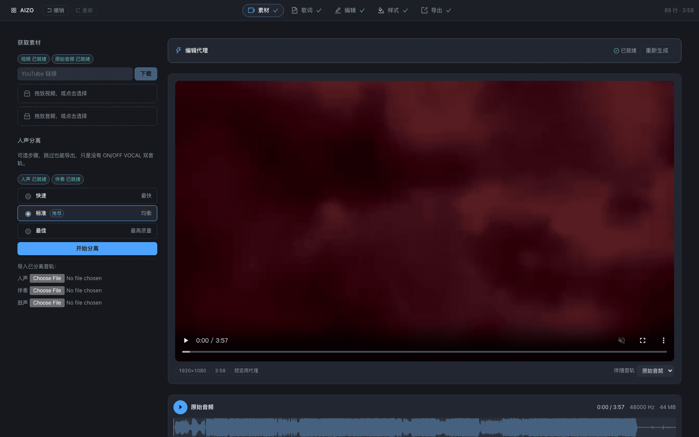
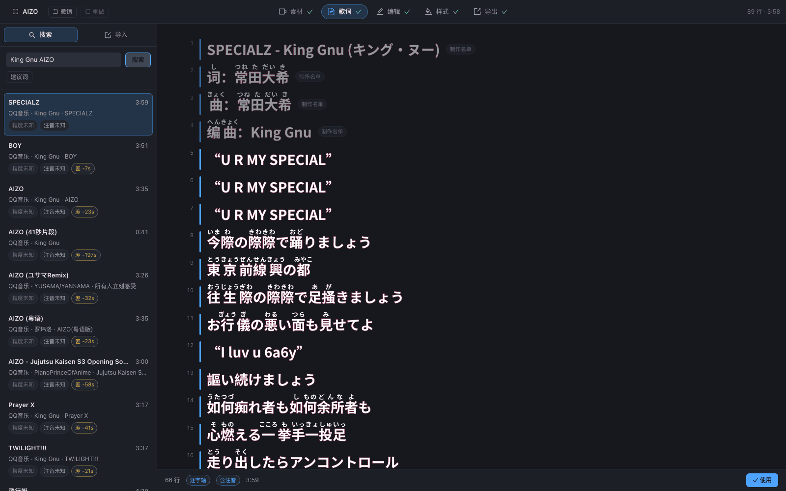
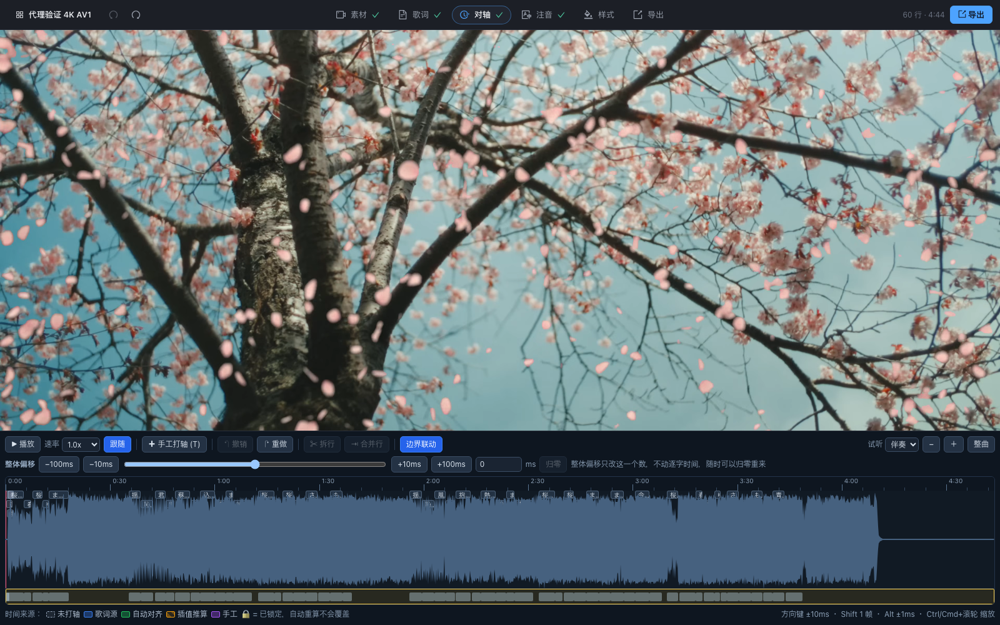
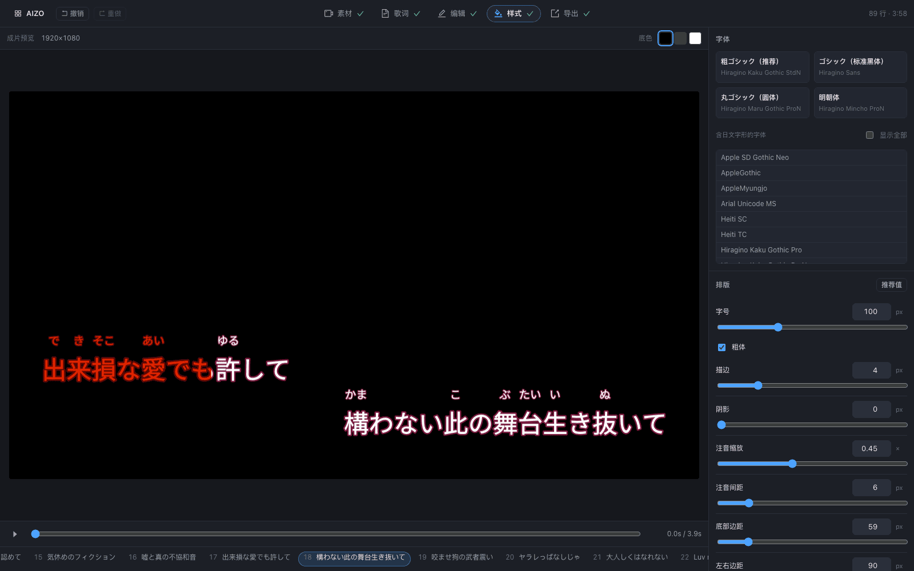
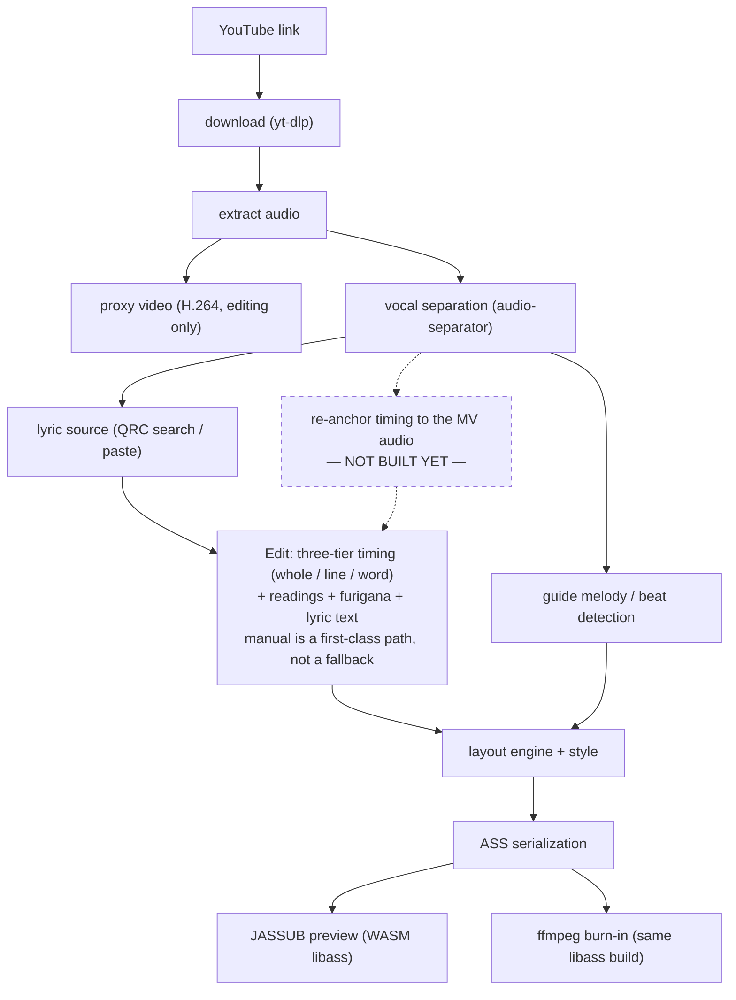

# Karaoke Video Maker (ニコカラ Maker)

**Language:** English | [简体中文](README.zh-CN.md) | [日本語](README.ja.md)

Give it a YouTube link, get back a finished karaoke video: word-by-word colour-sweep lyrics,
Japanese furigana (振り仮名), an optional vocals-off track. Separation, timing and reading
generation run on your machine — nothing is sent to a cloud AI service.





*Frames from a real export. The outline flips colour with the fill, which plain `\k` cannot do;
the countdown dots sit on beats detected from the separated drum stem.*

## Requirements

Install three things by hand — [`uv`](https://docs.astral.sh/uv/), **Node.js 18+** (verified on
22), and **ffmpeg built with libass**. The setup script installs everything else.

- **ffmpeg must have libass.** Mainline Homebrew `ffmpeg` does **not** — use `ffmpeg-full` on
  macOS, or a "full" / gyan.dev build on Windows. The check is by capability, never by version:
  the `ass` filter has to be registered, and the script fails loudly with the command to run if
  it is not.
- **macOS on Apple Silicon, or Windows x64.** Intel Macs are unsupported: PyTorch dropped
  Intel-macOS after 2.2 and separation needs it. Windows has never been run here.
- **Model weights download on first use** — 84–640 MB for separation, 2–89 MB for the pitch model.
  Never silently: the self-check reports what is missing and downloads nothing.
- **No cloud AI, by design.** Fetching video and lyric text is fine; sending audio or lyrics to a
  remote model is out of scope (`CLAUDE.md` §2.1).

## Install and run

```bash
python3 scripts/setup.py   # self-check, then install Python 3.12, the venv, and npm packages
python3 scripts/dev.py     # self-check again, then start backend + frontend together
```

Open `http://localhost:5173`; Ctrl-C stops both servers cleanly. Both scripts are stdlib-only
Python that runs on any 3.9+ interpreter — installing 3.12 is one of their jobs, so they cannot
require it. A blocking problem (no libass, Intel Mac, port already taken) stops the launch and
prints a copy-pasteable fix; a missing optional extra only warns, and names the feature you lose.

`setup.py --check-only` inspects without installing, `--minimal` skips `torch`, `--json` is
machine-readable; `dev.py --backend-port/--frontend-port` move the servers. For the environment
report on its own: `PYTHONPATH=backend uv run python -m kvm.doctor --copy`.

Driving it yourself instead: `uv sync --all-extras`, then
`uv run uvicorn --app-dir backend kvm.api.app:app` and `npm --prefix frontend run dev`.
Both servers set the COOP/COEP headers JASSUB needs for `SharedArrayBuffer`. A background font
scan at startup keeps the Style step on "scanning…" for its first 30–40 s.

> The editor UI is **Chinese only** today. Strings already route through `t()` in
> `frontend/src/i18n/`, but the English and Japanese tables are not written yet.

## Making your first video

Open `http://localhost:5173`, create a project, walk the five steps.

| Step | What you do |
|---|---|
| **1. Material** | Paste a YouTube link or drop in a local file. Separation runs from the same screen, three quality tiers. A low-res proxy video is built in the background, so a 4K AV1 source scrubs smoothly. |
| **2. Lyrics** | Search for a source, or paste and import text yourself — equal-weight entry points, not a happy path and a fallback. Candidates show their duration difference from your video: the best signal for telling the right release from a cover or a 41-second preview. Granularity and furigana read *unknown* until you open one, because the search endpoint does not know either. |
| **3. Edit** | The heart of the tool. Keep the per-character timing the source gave you, or build it yourself: play at 0.5–1.0×, tap <kbd>Space</kbd> per syllable, drag boundaries, nudge with arrow keys (±10 ms, ±1 ms with <kbd>Alt</kbd>). Colour shows where each timing came from. Readings, furigana and the lyric text are edited on this same stage. |
| **4. Style** | Pick a font; set size, outline and shadow as a share of frame height, so one style works at 1080p and 4K. Each voice part gets four colours — unsung fill and outline, sung fill and outline — because the outline flips with the fill. The preview is a real libass render of the finished frame over black, green or white. |
| **5. Export** | Choose the audio track and whether to mix in a synthesized guide melody (ガイドメロディ). Before a multi-minute burn, the cue rail jumps the preview to the spots most likely to be wrong: first line, verse heads, credits card, widest line, densest furigana, ending. |

| | |
|---|---|
|  |  |
|  |  |

### From the command line

Burns an MP4 from an already-imported QRC lyric plus a downloaded video. `--ass-only` skips the
burn for fast style iteration, `--start`/`--duration` render a segment, `--audio` swaps in an
instrumental for an OFF VOCAL cut, `--guide-vocals` mixes in a guide melody; `--help` is current.

```bash
uv run --python 3.12 --with numpy --with "librosa>=0.11" --with "numba>=0.61" \
  python backend/kvm/pipeline/make_video.py \
  --video  workspace/media/<video>.mkv --out workspace/out/final.mp4 \
  --parsed workspace/qrc/qrc_parsed.json --kana workspace/qrc/kana_entries.json \
  --drums  "workspace/sep_full/<track>_(Drums)_htdemucs.flac"
```

Separation alone — pass `onnxruntime` explicitly, `audio-separator` does not pull it in:

```bash
uv run --python 3.12 --with audio-separator --with onnxruntime audio-separator \
  workspace/media/audio_44k.wav --model_filename htdemucs.yaml \
  --model_file_dir workspace/models --output_dir workspace/sep_full
```

## How it works

The project file is the only source of truth: ASS is generated fresh on every preview and export,
and never parsed back. Every automatic value carries `(value, source, locked)`, and re-running an
automatic step only touches unlocked fields — that is what keeps a hand-timed chorus safe. More:
[`docs/architecture.md`](docs/architecture.md).



## What is not built yet

Verified against the code. Full breakdown, including what *does* work: [`docs/status.md`](docs/status.md).

- **Forced alignment / CTC timing.** Timing is QRC-provided or hand-made only.
- **Automatic reading generation.** No morphological analysis — furigana comes from the QRC kana
  track or from you.
- **Timeline re-anchoring.** Lyric timing targets the commercial master, not the MV audio: one
  global offset knob you set by ear, nothing automatic.
- **Lyric providers other than QQ Music.** Kugou, NetEase, LRCLIB, UtaTen, YouTube captions — all
  researched, none wired in.
- **Voice-part diarization**, and the lead/backing split — so no コーラス入り mix yet.
- **Downloading dependencies for you.** `python -m kvm.doctor` checks the environment and
  `scripts/setup.py` installs the Python and npm side, but ffmpeg is only *located*, never fetched.
- **Bundled fonts.** You pick from system fonts; glyph coverage *is* checked before you render.
- **Japanese and English UI**, and **Windows** has never been run.

## License and legal

There is **no `LICENSE` file yet**. The stated posture (`CLAUDE.md` §3) is private/self-use, at
most source-visible open source, no compiled binaries distributed. Treat the code accordingly.

- The forced-alignment model this design targets (`MMS_FA` weights) is **CC-BY-NC 4.0,
  noncommercial only**. It is not wired in yet, but once it is, **this project and anything made
  with it must not be used commercially** unless that model is swapped out first.
- The QRC decryption here was written from publicly documented constants, not copied from any GPL
  codebase.
- Downloading video and fetching lyrics is subject to the platforms' terms and copyright, and
  grants you no rights you did not already have. Not legal advice.

## Further reading

- [`docs/architecture.md`](docs/architecture.md) — why ASS is one-way, how locks survive edits.
- [`docs/status.md`](docs/status.md) — the full code-verified feature status.
- [`docs/ui-redesign.md`](docs/ui-redesign.md) — front-end information-architecture spec.
- `CLAUDE.md` — the engineering contract (Chinese). Dense, and the actual source of truth.
- Screenshots are script-generated — with both dev servers up: `node frontend/scripts/shot-readme.mjs [name]`.
