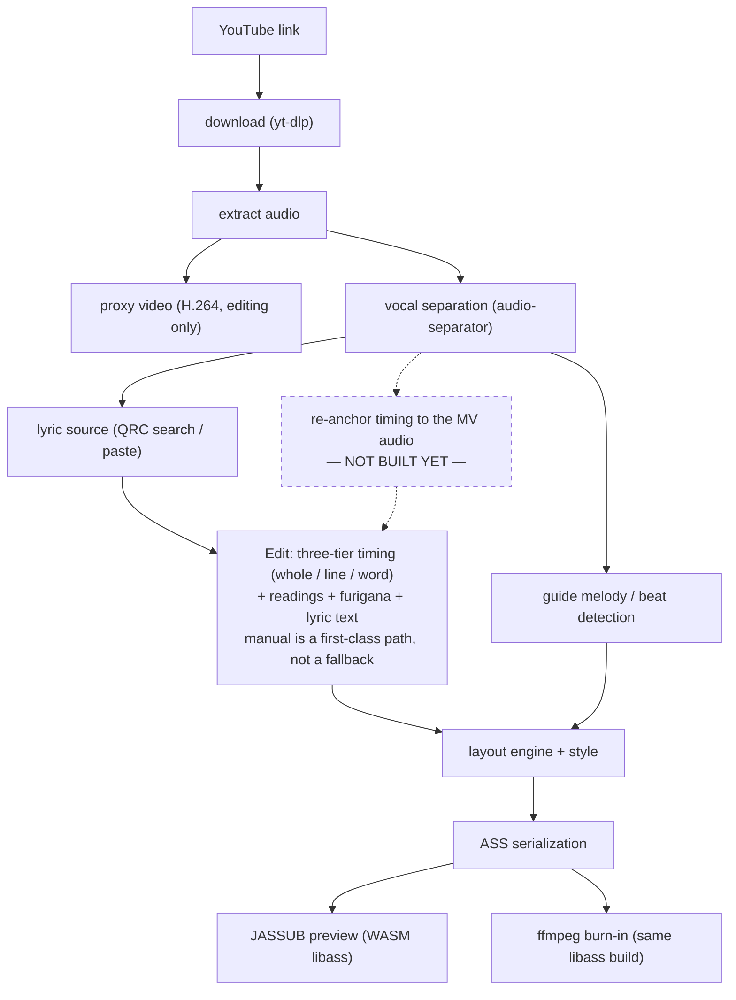

# Karaoke Video Maker (ニコカラ Maker)

**Language:** English | [简体中文](README.zh-CN.md) | [日本語](README.ja.md)

A one-stop, fully local **J-pop / anime karaoke ("nicokara") video generator**: give it a
YouTube link, get back a finished video with word-by-word color-sweep lyrics, Japanese
furigana (振り仮名), and optional dual audio tracks (vocals-on / vocals-off). Every
inference step — vocal separation, timing, reading generation — runs on your own machine.
Nothing is sent to a cloud AI service.


*A still frame from an actual rendered output: the currently-sung phrase turns blue, furigana
sits above the kanji, and the rest of the line stays white — the classic nicokara look. Note
that the outline flips colour with the fill, which plain `\k` karaoke tags cannot do.*


*Coming out of an instrumental break: three dots go out one at a time, right to left, and the
singer comes in as the last one disappears. The dots sit on beats detected from the separated
drum stem — evenly spaced dots look right but are useless to sing to.*

---

## What this actually is right now

This repository is under active development. There is a real, working **FastAPI backend**
(`backend/kvm/`) and a real **React + TypeScript editor** (`frontend/src/`), not just a design
document. Concretely, today you can:

- Pull a video via `yt-dlp` (YouTube, and experimentally Bilibili) or import a local file
- Separate vocals from instrumental locally with `audio-separator` (three quality tiers), and
  get a lightweight H.264 proxy video generated automatically so scrubbing a 4K AV1 source
  doesn't crawl
- Search QQ Music for a character-level, furigana-tagged lyric source (QRC), or paste/import
  lyrics by hand (plain text, LRC, or QRC)
- Time every line and word against a waveform — tap-to-time, drag boundaries, ripple-link
  neighbours, global offset nudge — with full undo/redo and per-item locks, so hand-tuned
  timing is never silently overwritten by a later automatic pass
- Edit furigana per character span, with a visible "where did this reading come from" badge,
  and rewrite a line's lyric text in place when the source got the words wrong — the editor
  reports how much timing survived the rewrite instead of quietly discarding it
- Pick a font from the fonts installed on your machine, tune size/outline/shadow as a
  percentage of frame height, assign a four-colour palette per voice part, and check all of it
  against a **real libass render of the actual finished frame**, not a CSS mock-up
- Export a burned-in MP4, optionally with an OFF VOCAL cut and/or a synthesized guide melody
  (ガイドメロディ) mixed into the instrumental track, and download the result straight from
  the browser

The project's working contract — `CLAUDE.md` at the repo root — describes a considerably
larger target architecture (forced alignment, morphological-analysis-based reading generation,
multi-provider lyric search, automatic environment self-check, automatic dependency
acquisition, etc.). Some of that is implemented, some is not yet. **§ Project status** below is
an honest, code-verified breakdown — read it before assuming a feature exists.

| | |
|---|---|
|  |  |
| **Edit** step — waveform + per-token timeline + timing-source colours | **Edit** step — the same selection, inspected as a reading |

Timing and furigana are deliberately *one* step, not two: they fix the same selected word from
two angles (when it is sung, how it is read), and a separate furigana step had no way to play
audio — which is the only way to check a reading.

---

## Hard prerequisites (read this before you try to install anything)

Skipping any of these will make the app fail in a way that's not obviously about the thing you
skipped, so check them up front.

1. **ffmpeg must be built with libass, and you must verify it by capability, not by version
   number.** The mainline Homebrew `ffmpeg` formula does **not** include libass — you need
   `ffmpeg-full` (macOS) or a "full"/gyan.dev-style build with `--enable-libass` (Windows).
   Verify with:

   ```bash
   ffmpeg -h filter=ass
   ```

   If this prints `Unknown filter 'ass'` (or similar), your ffmpeg cannot burn subtitles and
   nothing downstream will work, no matter what `ffmpeg -version` says. On this machine,
   `brew install ffmpeg-full` gives ffmpeg 8.1.2 with the `ass` filter registered — confirmed
   working while writing this README.

2. **Python 3.12, managed by [`uv`](https://docs.astral.sh/uv/).** The project pins
   `requires-python = ">=3.12,<3.13"`; don't fight this with whatever Python your OS ships.
   `uv python install 3.12` gets you a pinned interpreter without touching the system one.

3. **Node.js** (18+ recommended; developed and verified against Node 22 / npm 10) for the
   frontend.

4. **Model weights are downloaded at first use, not bundled.** Vocal separation models range
   from ~84 MB (fast tier) to ~640 MB (best tier); the guide-melody pitch model is 2–89 MB
   depending on which CREPE variant you pick. First run of a feature that needs a model will
   pause to download it — this is expected, not a hang, but you do need network access at
   that moment even though the rest of the pipeline is offline-capable afterward.

5. **Apple Silicon (arm64) only on macOS — Intel Macs are not supported.** PyTorch dropped
   Intel-macOS support after 2.2, and vocal separation depends on it. On Windows, x64 with
   either an NVIDIA GPU (CUDA) or CPU-only both work, at very different speeds.

6. **No cloud AI, by design.** Downloading source video/audio and fetching lyric text over the
   network is fine; sending audio or lyrics to a remote model for inference is explicitly out
   of scope for this project (see `CLAUDE.md` §2.1). If you're evaluating this repo, don't
   expect (or add) an "optional cloud acceleration" mode.

---

## Getting started

Clone the repo, then from the repository root:

```bash
# Python toolchain (backend)
uv python install 3.12
uv sync --extra api --extra fonts --extra audio --extra separate --extra download --extra lyrics

# Node toolchain (frontend)
cd frontend && npm install && cd ..
```

Dependencies are grouped in `pyproject.toml` on purpose: the core pipeline is light, and heavy
extras (`torch`-based separation, `librosa`-based audio analysis) only get pulled in if you
actually use those features. `uv sync` with no `--extra` flags gives you just enough to run the
render pipeline on already-prepared inputs.

### Run the backend

```bash
uv run uvicorn --app-dir backend kvm.api.app:app --host 127.0.0.1 --port 8000 --reload
```

(`--app-dir backend` is required because the importable package is `backend/kvm/`, not a
top-level `kvm/` — this is the exact invocation the dev server on this machine is running
under.) On startup it also kicks off a background system-font scan (can take 30–40 seconds on
a machine with many fonts installed); the style step in the editor will show a "scanning…"
state until that finishes, rather than blocking.

The backend serves `GET /api/health` and sets the COOP/COEP headers the frontend's libass-based
previewer (JASSUB) needs for `SharedArrayBuffer`.

### Run the frontend

```bash
cd frontend
npm run dev
```

This starts Vite on `http://localhost:5173` with the COOP/COEP headers already configured, and
copies JASSUB's worker/wasm assets into `public/` first (`predev` hook). Open that URL, and
you'll land on the project library (create a new project, or open an existing one):


The editor
is a five-step flow: **素材/Material → 歌词/Lyrics → 编辑/Edit → 样式/Style → 导出/Export**.
Each step's stage takes over the full main area with whatever that step actually needs — a
waveform and timeline for editing, a rendered film frame for styling — rather than forcing
everything through a fixed "video player + timeline" shell. Playback belongs to the Edit
stage alone, so a stray second play button can't exist.

> The editor UI text is **Chinese only** right now. There's an i18n abstraction in
> `frontend/src/i18n/` (all UI strings already route through a `t()` function), but the
> Japanese and English string tables haven't been written yet, and there's no in-app language
> switcher. If you don't read Chinese, the five step icons and the screenshots in this README
> are your best guide for now.

---

## Producing your first video

### Via the GUI (recommended)

**1. Material.** Create a project, paste a YouTube link (or drop in a local video/audio file)
and let it download. Vocal separation starts from the same screen — pick a tier and go. Every
track you end up with (mix, vocals, instrumental, drums) gets its own card with a waveform and
a play button, and a low-resolution proxy video is built in the background for smooth scrubbing.


**2. Lyrics.** Search for a lyric source, or paste/import text yourself — the two are
equal-weight entry points, not a happy path and a fallback. Search results show how far each
candidate's duration is from your video's, which is the single best signal for telling the
right release apart from a cover, a live cut, or a 41-second preview clip. Granularity and
furigana are listed as *unknown* until you actually open a candidate, because the search
endpoint genuinely doesn't know — the preview pane on the right is where you find out whether
you got per-character timing and a kana track, before you commit to it.


**3. Edit.** The heart of the tool. Accept the character-level timing the lyric source gave
you, or build it yourself: play at 0.5–1.0×, tap <kbd>Space</kbd> once per syllable
(tap-to-time), then refine by dragging boundaries, nudging with arrow keys (±10 ms, ±1 ms with
<kbd>Alt</kbd>), splitting and merging. Colour tells you where every timing came from —
untimed, from the lyric source, interpolated, or hand-set and locked. The same stage edits
readings and, when the source got the words wrong, the lyric text itself.

**4. Style.** Choose a font, set size/outline/shadow (as a share of frame height, so the same
style works at 1080p and 4K), and give each voice part its own four colours — unsung fill and
outline, sung fill and outline — because the outline flips colour along with the fill as the
sweep passes. The preview on the left is a genuine libass render of the finished frame, over
black, green, or white so you can check that the outline survives on any background.


**5. Export.** Choose the audio track (original or instrumental) and whether to mix in a
synthesized guide melody, then render. Before committing to a multi-minute burn, the cue rail
jumps the preview to the places most likely to be wrong — the first line, each verse head, the
credits card, the widest line, the most furigana-dense line, the ending. Finished files are
listed with size and duration and download straight from the browser.


### Via the CLI (useful for iterating on rendering/style code without the GUI)

The CLI takes an already-imported QRC lyric (`qrc_parsed.json` + `kana_entries.json`, as
produced by the QRC import pipeline) and a downloaded video, and burns a finished MP4:

```bash
uv run --python 3.12 --with numpy --with "librosa>=0.11" --with "numba>=0.61" \
  python backend/kvm/pipeline/make_video.py \
  --video   workspace/media/<video>.mkv \
  --parsed  workspace/qrc/qrc_parsed.json \
  --kana    workspace/qrc/kana_entries.json \
  --drums   "workspace/sep_full/<track>_(Drums)_htdemucs.flac" \
  --out     workspace/out/final.mp4
```

Useful flags (all confirmed via `--help`): `--ass-only` to generate just the `.ass` file for
fast style iteration; `--start`/`--duration` to render a short preview segment; `--audio` to
swap in an instrumental track for an OFF VOCAL export; `--guide-vocals` to synthesize and mix
in a guide melody (with `--guide-timbre`, `--guide-gain`, and several shaping parameters); `--offset-ms`
for a global timing offset. Run `python backend/kvm/pipeline/make_video.py --help` for the full,
current list — it changes as the pipeline evolves, so treat this README's flag list as a
pointer, not the source of truth.

Vocal separation from the CLI:

```bash
uv run --python 3.12 --with audio-separator --with onnxruntime audio-separator \
  workspace/media/audio_44k.wav --model_filename htdemucs.yaml \
  --model_file_dir workspace/sep_probe/models --output_dir workspace/sep_full
```
(`audio-separator` doesn't pull in `onnxruntime` on its own — pass it explicitly, or the
separation step will fail with an import error.)

---

## How it works

**The single source of truth is the project file — never the ASS subtitle file.** ASS is a
render *target*, generated fresh from the project's data model every time you export or
preview; it is never parsed back into the project. This matters because every stage below is
designed to only overwrite fields that haven't been locked by a manual edit — if ASS were
round-tripped, that guarantee would be impossible to keep.



The dashed box is the one stage in that picture that does not exist yet — see **§ Project
status**. Everything else is code you can run today.

A few design points worth calling out:

- **"One-stop" is a hard product constraint, not a nice-to-have.** There is no step in this
  pipeline where the intended UX is "now go do this part in Aegisub." Every automatic step
  (download, lyric fetch, timing, reading, line-breaking, paragraph detection) has a manual
  fallback in the same UI, and automatic failures degrade gracefully rather than blocking the
  pipeline.
- **Every automatically-produced value carries `(value, source, locked)`.** Re-running an
  automatic step only touches fields where `locked = false`. This is what makes "the aligner
  reran and it's fine, my hand-timed chorus is untouched" actually true rather than aspirational
  — it's enforced in `backend/kvm/editing/ops.py`, not just documented.
- **Timing units are always milliseconds internally**; centiseconds (`\k` in ASS) only exist at
  serialization time, and are derived by rounding cumulative timestamps and taking differences —
  not by rounding each duration independently — to avoid drift accumulating across a long line.
- Preview (JASSUB, a WASM build of libass) and export (ffmpeg's `ass` filter) are intended to
  render from the *same* libass build so what you see while editing matches the burned-in
  output; see `CLAUDE.md` §5.12 for the specifics this project tracks to keep that true.

For the full architecture — the project file's data model, the reading-priority system, the
ASS-generation layout engine, every already-run experiment and its result — see `CLAUDE.md` at
the repo root. It's long and dense on purpose: it's the actual engineering contract this
project is built against, not marketing copy.

---

## Project status

This section is generated from reading the actual code, not from the design doc. Where the two
disagree, the code wins here.

**Implemented and working (verified in this environment):**

- FastAPI backend with routers for projects (incl. undo/redo + autosave-on-mutate), lyric
  search/preview/apply/import, media download/separation/proxy generation, editing operations
  (shift/set-timing/lock/ruby/split/merge/voice-part), ASS generation + async export jobs, and
  system-font scanning/coverage-checking/subsetting
- A five-step React editor (Material / Lyrics / Edit / Style / Export) with a project
  library/home screen, undo/redo, and a stage layout that gives each step the full main area
  instead of a fixed video-player-centric shell. Timing and furigana were originally two
  separate steps and have been merged into **Edit**
- Tap-to-time manual timing against a waveform, boundary dragging with optional ripple into the
  neighbouring token, global-offset nudge, line/token split and merge, and a visible
  timing-source legend (un-timed / lyric-source / auto-aligned / interpolated / manual+locked)
- Manual + lyric-source-driven furigana editing with per-span source badges, plus in-place
  rewriting of a line's lyric text that carries the existing timing, readings and voice parts
  across and reports what it could not re-attach
- YouTube (and experimental Bilibili) download via yt-dlp, with audio-quality-first stream
  selection and content-start-offset detection
- Local vocal separation via `audio-separator`, run in an isolated subprocess with JSON-lines
  progress reporting and content-hash-keyed caching (not in-process, not blocking the API)
- Editor proxy video generation — a short-GOP, audio-less H.264/MP4 rendition of an
  otherwise unplayable source (4K AV1 in Matroska), used for editing only, never for export
- Backend-precomputed waveform peaks (multi-level LOD, BBC `audiowaveform` binary format) and
  an ffprobe-backed media probe endpoint, so the browser never has to decode whole tracks
- QQ Music QRC lyric search/fetch, including the (non-standard, buggy-S-box) DES decryption —
  independently reimplemented in Python from publicly-documented constants, importing no
  third-party decryption code
- ASS generation with the double-layer progressive-`\clip` karaoke sweep (fill *and* outline
  change colour together), per-line fade in/out, per-voice-part colour segmentation within a
  line, a centred credits card, and "get ready" indicator dots placed on detected beats
- Guide melody synthesis (CREPE pitch extraction → median filter → note segmentation →
  semitone quantization → band-limited harmonic synthesis, mixed into the instrumental) and
  drum-stem-based beat detection
- Real libass preview in the browser (JASSUB) fed by the *same* ASS the exporter burns, on both
  the Edit and Style and Export stages; system fonts are subsetted server-side so the preview
  can use the same family the export will
- 350 passing tests (1 skipped) at time of writing, run with `uv run pytest -q`
- ffmpeg auto-*detection* (capability-probed, not version-probed) across known install locations

**Designed but not yet implemented — do not assume these exist:**

- **Forced alignment / CTC-based timing** — the data model has `TimingSource.ALIGNED` reserved,
  but nothing in the pipeline currently produces it; today's timing is QRC-provided or manual
  only. The re-anchoring-to-MV-audio experiment (`experiments/reanchor_xcorr.py`) is a standalone
  script, not wired into the pipeline.
- **Automatic reading generation** (morphological analysis, dictionary lookup, acoustic
  disambiguation) — `ReadingSource.MORPH`/`DICT`/`ACOUSTIC` are reserved enum values with no
  producer yet. Furigana today comes from the QRC kana track or manual entry only.
- **Additional lyric providers** — Kugou, NetEase, LRCLIB, UtaTen, and YouTube's own captions
  are all researched (see `CLAUDE.md` §5.2 and the `experiments/` scripts) but only QQ Music is
  wired into the production `kvm.lyrics` package today.
- **Timeline re-anchoring** — lyric sources are timed against the commercial master, not the
  MV's audio, and nothing corrects for that automatically. There is one global offset knob you
  set by ear (`global_offset_ms`), and that's it.
- **Speaker/voice-part diarization** — voice parts are assigned manually via the editor; there
  is no automatic lead/backing-vocal detection, and no second separation pass that would split
  a lead vocal from its backing harmonies (so no コーラス入り variant yet).
- **Automatic dependency acquisition** — ffmpeg is *located* if already present, but not
  auto-downloaded/installed into an app-private directory yet; there's no environment
  self-check command (`backend.doctor` doesn't exist yet). Separation and yt-dlp are the
  exceptions: both install/update themselves into an app-private environment on demand.
- **Bundled fonts** — the style step lets you pick from fonts already installed on your system,
  it does not ship or auto-fetch any font files itself. Glyph coverage *is* checked before you
  render: the style step reports whether the selected font covers every character in the song
  (lyrics, furigana and the credits screen), and the export step repeats the check right above
  the button. Missing glyphs are a warning, not a block — you can still export. One caveat the
  check reports separately: the in-app preview feeds libass a *subset* of the font (ASCII, kana
  and JIS X 0208 kanji), so characters outside that set — `鷗`, `α`, `①` — are blank in the
  preview while the burned-in video renders them fine.
- **A persisted phonetic reading layer** — the project model and API do carry a separate
  "how it is actually sung" reading alongside the displayed furigana (particle は → ワ, and so
  on), with a rule-based derivation endpoint. The editor, however, still keeps the phonetic
  field in browser local storage and never sends it, so it does not survive moving to another
  machine. It matters only once forced alignment lands, which it hasn't.
- **Japanese/English UI** — as noted above, the editor is Chinese-only; the i18n plumbing exists,
  the translations don't.
- **Windows** has not been exercised in this environment (developed and verified here on macOS
  Apple Silicon only); the architecture targets both platforms per `CLAUDE.md` §2.2, but nobody
  has run it on Windows yet as far as this README's author could verify.

If you're deciding whether to rely on a specific feature, grep the code before trusting either
this list or `CLAUDE.md` — both age, the code is ground truth.

---

## License and legal notes

There is currently **no `LICENSE` file in this repository**. The project's stated distribution
posture (see `CLAUDE.md` §3) is: private/self-use, at most published as source-visible open
source — **no compiled binaries are distributed**. Treat the code accordingly until a license
file says otherwise.

A few things that follow from that posture and are worth knowing if you build on this repo:

- Some optional runtime dependencies are **GPL-licensed** (e.g. `pykakasi`, some lyric-provider
  reference implementations this project deliberately does *not* import from — see `CLAUDE.md`
  §3/§6.1 for exactly what was and wasn't used). This project's own QRC-decryption code was
  independently written in Python from publicly-documented constants, not copied from any
  GPL codebase.
- The forced-alignment model this project's design targets (`MMS_FA` / `ctc-forced-aligner`
  weights) is **CC-BY-NC 4.0 — noncommercial only**. It isn't wired into the pipeline yet (see
  Project status above), but if/when it is, **this project and anything produced with it must
  not be used commercially** unless that model is swapped out first.
- **Downloading video/audio and scraping lyric text is subject to the terms of service and
  copyright of the platforms involved** (YouTube, QQ Music, etc.). This tool automates fetching
  publicly-served data for personal, non-commercial use; it does not grant you any rights you
  didn't already have, and you're responsible for how you use it. This is not legal advice.

---

## Further reading

- `CLAUDE.md` (repo root) — the full engineering contract: data model, every technology
  decision and why, every experiment already run and its result, and every open question still
  being worked through. Long, dense, and the actual source of truth for anyone contributing.
- `docs/ui-redesign.md` — the current front-end information-architecture spec (the five-step
  stage-based shell described above is what this document specifies).

Every screenshot in this README is generated by a script, so that changing the UI does not
silently leave the docs showing last month's build. With the backend and frontend dev servers
already running, regenerate all of them with:

```bash
node frontend/scripts/shot-readme.mjs          # all of them
node frontend/scripts/shot-readme.mjs step-style   # or just one
```

It picks the project with the most complete data as the sample, strips any absolute paths that
would otherwise leak a local username into the images, and compresses the results with
`pngquant`. The two rendered-video frames additionally need a source video and a generated
`.ass` in `workspace/`; without them that step is skipped rather than failing.
