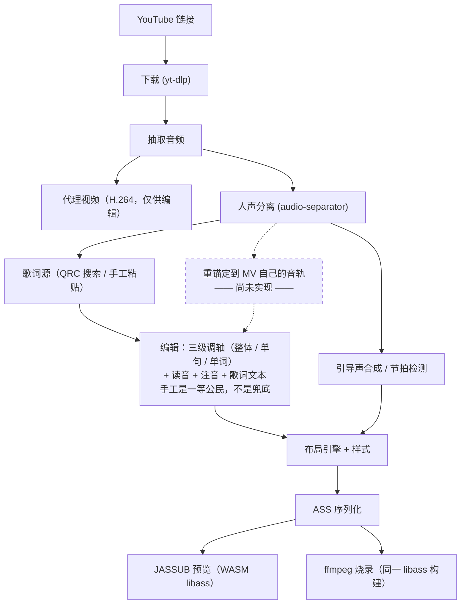

# Karaoke Video Maker（ニコカラ 卡拉OK 视频制作工具）

**语言：** [English](README.md) | 简体中文 | [日本語](README.ja.md)

给一个 YouTube 链接，出一个成品卡拉OK 视频：逐字扫色歌词、日语振り仮名、可选的去人声音轨。
去人声、对轴、读音生成全部跑在你自己的机器上，不调用任何云端 AI 服务。


*实际渲染产物的截帧。描边跟着填充一起翻色，这件事光靠 ASS 的 `\k` 做不到；
开唱引导点踩在从分离出的鼓组轨检测到的真实拍点上。*

## 硬性前提

- **ffmpeg 必须带 libass。** Homebrew 主线 `ffmpeg` 配方**不含** libass，macOS 要装
  `ffmpeg-full`，Windows 要用带 `--enable-libass` 的 "full" / gyan.dev 构建。
  判据是能力不是版本号：`ffmpeg -h filter=ass` 必须打印出滤镜参数，而不是 `Unknown filter 'ass'`。
- **Python 3.12**（由 [`uv`](https://docs.astral.sh/uv/) 管理）与 **Node.js 18+**（本机用 22 验证）。
- **macOS 仅支持 Apple Silicon，或 Windows x64。** 不支持 Intel Mac：PyTorch 2.2 之后停止
  支持 Intel macOS，而人声分离依赖它。Windows 至今没人实跑过。
- **模型权重是首次用到时才下载的**：分离模型 84MB～640MB，引导声的音高模型 2～89MB。
- **设计上禁止云端 AI。** 下载视频、抓歌词文本可以；把音频或歌词发给远程模型做推理不行
  （见 `CLAUDE.md` §2.1）。

## 安装与启动

```bash
uv python install 3.12
uv sync --extra api --extra fonts --extra audio --extra separate --extra download --extra lyrics
cd frontend && npm install && cd ..
uv run uvicorn --app-dir backend kvm.api.app:app --host 127.0.0.1 --port 8000 --reload  # 终端 1
cd frontend && npm run dev                                              # 终端 2 → :5173
```

`--extra` 是可选的：不带任何 extra 的 `uv sync` 已经能在备好的素材上跑渲染，不会装 `torch`。
`--app-dir backend` 必须加——可导入的包是 `backend/kvm/`，不是顶层 `kvm/`。两个服务都会设置
JASSUB 用 `SharedArrayBuffer` 所需的 COOP/COEP 响应头。后端启动时在后台扫系统字体，
所以"样式"步骤最初 30～40 秒会显示"正在扫描…"。

> 编辑器界面目前**只有中文**。文案已经全部走 `frontend/src/i18n/` 的 `t()` 取值，
> 但英文与日文的文案表还没写。

## 跑通第一个视频

打开 `http://localhost:5173`，新建工程，走完五步。

| 步骤 | 做什么 |
|---|---|
| **1. 素材** | 粘贴 YouTube 链接或拖入本地文件。人声分离就在同一屏发起，三档质量任选。后台同时生成一份低分辨率代理视频，4K AV1 源也能顺畅拖动。 |
| **2. 歌词** | 搜索歌词源，或者自己粘贴 / 导入——两者是等价的入口，不是"正路"和"兜底"。候选会标出与你视频的时长差，这是区分正确版本与翻唱、Live、41 秒试听片段最有效的信号。粒度和有无注音在打开候选之前一律显示"未知"，因为搜索接口是真的不知道。 |
| **3. 编辑** | 整个工具的核心。可以沿用歌词源给的逐字时间，也可以自己从零打：0.5～1.0 倍速播放，每个音节敲一下 <kbd>空格</kbd>，再拖边界、用方向键微调（±10ms，按 <kbd>Alt</kbd> 是 ±1ms）。颜色直接告诉你每处时间是哪来的。读音、注音，以及歌词源写错时的整行文本改写，都在这同一个舞台上。 |
| **4. 样式** | 选字体，按画面高度的百分比设字号 / 描边 / 阴影，同一套样式在 1080p 和 4K 下观感一致。每个声部四种颜色——未唱的填充与描边、已唱的填充与描边——因为描边是跟着填充一起翻色的。预览是成片画面的真实 libass 渲染，底色可切黑 / 绿 / 白。 |
| **5. 导出** | 选音轨、选要不要混入合成的引导声（ガイドメロディ）。花几分钟烧片之前，关键位置条会把预览跳到最容易出问题的地方：第一句、每段开头、制作名单、最长的一行、注音最密的一行、末句。 |

| | |
|---|---|
|  |  |
|  |  |

### 用命令行

吃一份已导入的 QRC 歌词加一个下载好的视频，直接烧出成品。`--ass-only` 跳过烧录、秒级迭代样式，
`--start`/`--duration` 只渲一小段，`--audio` 换伴奏轨出 OFF VOCAL，`--guide-vocals` 混入引导声；
完整参数以 `--help` 为准。

```bash
uv run --python 3.12 --with numpy --with "librosa>=0.11" --with "numba>=0.61" \
  python backend/kvm/pipeline/make_video.py \
  --video  workspace/media/<视频>.mkv --out workspace/out/成品.mp4 \
  --parsed workspace/qrc/qrc_parsed.json --kana workspace/qrc/kana_entries.json \
  --drums  "workspace/sep_full/<曲名>_(Drums)_htdemucs.flac"
```

单独做人声分离——`onnxruntime` 必须显式加上，`audio-separator` 不会自动带：

```bash
uv run --python 3.12 --with audio-separator --with onnxruntime audio-separator \
  workspace/media/audio_44k.wav --model_filename htdemucs.yaml \
  --model_file_dir workspace/models --output_dir workspace/sep_full
```

## 架构简述

**唯一真源是工程文件，不是 ASS。** ASS 每次预览、每次导出都重新生成，永远不会被反向解析回来。
每一个自动产生的值都带 `(value, source, locked)`，自动重跑只覆盖没锁的字段——手工调好的副歌
因此不会被冲掉。展开见 [`docs/architecture.md`](docs/architecture.md)（英文）。



## 还没做的部分

对照代码逐项核实过。完整清单（含已经能跑的部分）见 [`docs/status.md`](docs/status.md)（英文）。

- **强制对齐 / CTC 自动打轴**——没有。时间轴只可能来自 QRC 或手工。
- **自动读音生成**——没有形态素分析，注音只来自 QRC 的假名轨或你自己输入。
- **时间轴重锚定**——歌词源的轴对准的是商业母带而非 MV 音轨，没有任何自动校正，
  只有一个靠耳朵调的全局偏移旋钮。
- **QQ 音乐以外的歌词源**——酷狗、网易云、LRCLIB、UtaTen、YouTube 官方字幕都调研过，
  一个都还没接进生产链路。
- **声部自动归属**，以及把人声再拆成主唱与和声的第二段分离——所以还出不了 コーラス入り。
- **依赖自动获取与 `backend.doctor`**——ffmpeg 只做查找，不会自动下载安装。
- **随应用打包字体**——只能从系统已装字体里选；字形覆盖**在渲染前会检查**。
- **日语 / 英语界面**；**Windows** 至今没人实跑过。

## 许可证与合规

**仓库目前没有 `LICENSE` 文件。** 当前定位（见 `CLAUDE.md` §3）是私有自用，顶多以可见源码
形式开源，不分发编译好的二进制。在有明确许可证之前请按这个定位对待这份代码。

- 设计上要用的强制对齐模型（`MMS_FA` 权重）是 **CC-BY-NC 4.0，禁止商用**。它现在还没接入，
  但一旦接入，**除非先换掉这个模型，否则本项目及其产出都不得用于商业用途**。
- 本项目的 QRC 解密是基于公开可查的常量独立写的，不是从任何 GPL 代码库抄的。
- 下载视频、抓取歌词受相关平台的服务条款与版权约束，也不会给你任何原本没有的权利。
  这不是法律意见。

## 延伸阅读

- [`docs/architecture.md`](docs/architecture.md)（英文）——ASS 为什么是单向的、锁怎么在改动后存活。
- [`docs/status.md`](docs/status.md)（英文）——对照代码核实过的完整功能现状。
- [`docs/ui-redesign.md`](docs/ui-redesign.md)——前端信息架构规格。
- `CLAUDE.md`——完整的工程契约，又长又密，是本项目真正的依据。
- 截图都是脚本生成的——前后端 dev server 都跑着时执行 `node frontend/scripts/shot-readme.mjs [名字]`。
