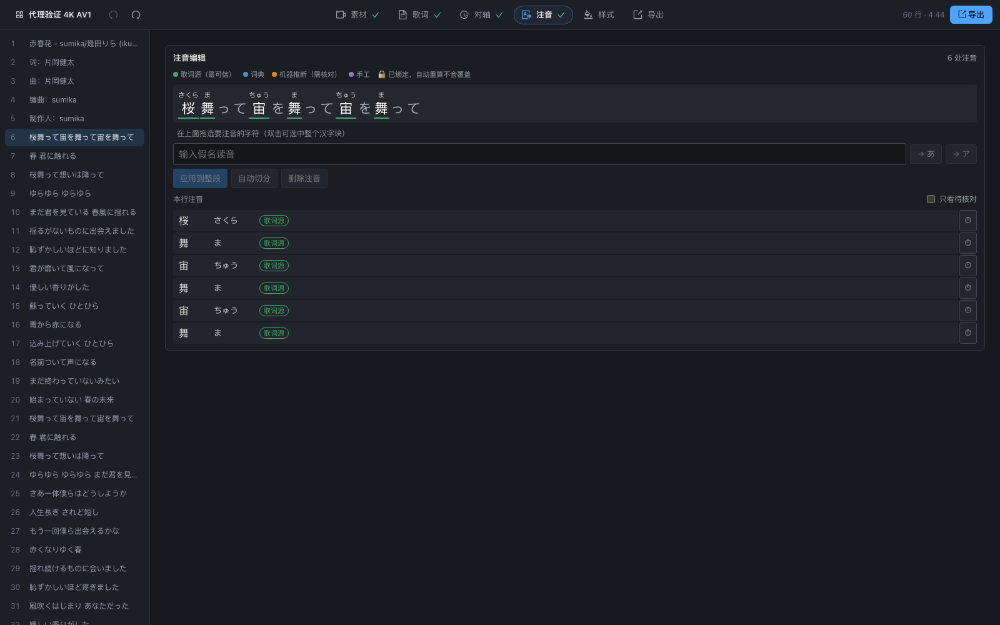
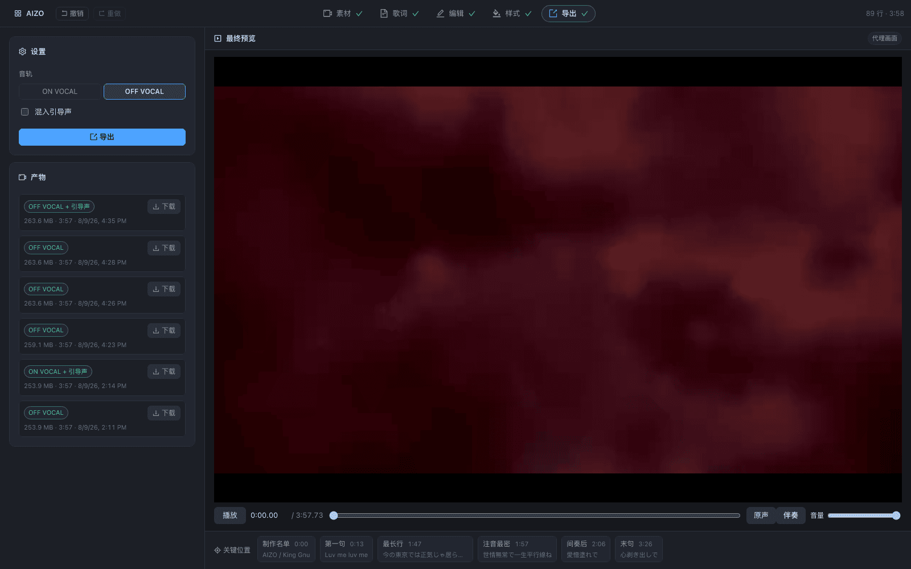
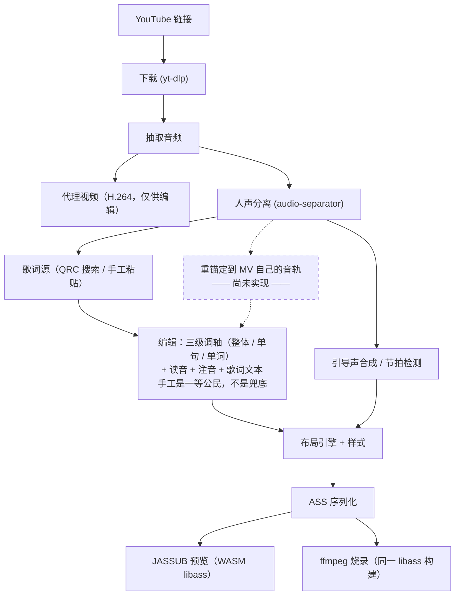

# Karaoke Video Maker（ニコカラ 卡拉OK 视频制作工具）

**语言：** [English](README.md) | 简体中文 | [日本語](README.ja.md)

一个**全程本地运行**的一站式日式卡拉OK（ニコカラ）视频制作工具：输入一个 YouTube 链接，
输出一个带**逐字扫色歌词**、**日语振り仮名（注音）**、可选 **ON VOCAL / OFF VOCAL 双音轨**
的成品视频。去人声、对轴、读音生成——所有推理都跑在你自己的机器上，不调用任何云端 AI 服务。


*实际渲染产物的截帧：正在唱的短语变蓝、汉字上方带振り仮名、其余部分保持白色——
这是 nicokara 最典型的观感。注意**描边是跟着填充一起翻色的**，这件事光靠 ASS 的 `\k`
标签做不到。*


*间奏即将结束：三个点自右向左逐个熄灭，最后一个消失时正好开唱。点踩在从分离出的鼓组轨
检测到的真实拍点上——等间距的点看着像那么回事，但唱的人跟不进去。*

---

## 这个仓库现在到底是什么状态

这是一个正在开发中的项目，但**不是只有设计文档**：`backend/kvm/` 下是一个真实可跑的
**FastAPI 后端**，`frontend/src/` 下是一个真实可用的 **React + TypeScript 编辑器**。
具体来说，现在你可以：

- 用 `yt-dlp` 拉取视频（YouTube，Bilibili 为实验性支持），或直接导入本地文件
- 用 `audio-separator` 在本地做人声分离（三档质量可选）；同时自动生成一份轻量 H.264
  代理视频，4K AV1 源在编辑器里也能顺畅拖动
- 搜索 QQ 音乐拿到逐字、带注音标记的 QRC 歌词源，或手工粘贴/导入歌词（纯文本 / LRC / QRC）
- 对着波形给每一行、每一个词打轴：tap-to-time 打点、拖拽边界（可联动相邻字）、
  整体偏移微调、拆行合行，全程支持撤销/重做，且每一项都可单独锁定——手工调好的时间轴
  不会被后续自动重算悄悄覆盖
- 逐字符区间编辑注音，每处注音都能看到"这个读音是哪来的"的来源徽章；歌词源把词写错时
  还能就地改写整行歌词文本，改完会告诉你有多少时间轴接住了、有多少没接住
- 从本机已安装的系统字体里选字体，按画面高度百分比调字号/描边/阴影，按声部指派四色配色，
  并且这一切都对着**成片画面的真实 libass 渲染**去调，不是 CSS 仿的样子货
- 导出烧录好的 MP4，可选 OFF VOCAL（去人声）音轨和/或混入合成的引导声（ガイドメロディ），
  成品直接从浏览器下载

仓库根目录的 `CLAUDE.md` 是这个项目的工作契约，里面描述的目标架构比现状大得多
（强制对齐、基于形态素分析的自动注音、多歌词源、环境自检、依赖自动获取……）。
其中一部分已经落地，一部分还没有。下面的"**项目现状**"一节是对照代码逐项核实后的
诚实清单——先看那一节，再假设某个功能已经存在。

| | |
|---|---|
|  |  |
| **编辑**步骤——波形 + 逐字时间轴 + 时间来源配色 | **编辑**步骤——同一份歌词，看的是读音 |

对轴和注音是**同一步**，不是两步：它们修的是同一个选中词的两个侧面（何时唱、怎么读），
而单独的注音步骤没有任何播放能力——可读音偏偏只能靠耳朵验证。

---

## 硬性前提（装之前先看这些，漏一条都可能装不起来）

1. **ffmpeg 必须带 libass，且判据是能力而不是版本号。** Homebrew 主线 `ffmpeg` 配方
   **不含** libass，必须用 `ffmpeg-full`（macOS）或 Windows 上带 `--enable-libass` 的
   "full" / gyan.dev 构建。验证方法：

   ```bash
   ffmpeg -h filter=ass
   ```

   如果输出是 `Unknown filter 'ass'` 之类，说明这个 ffmpeg 烧不了字幕，后面全部走不通，
   不管 `ffmpeg -version` 报的版本号多新。本机用 `brew install ffmpeg-full` 装出来是
   ffmpeg 8.1.2，`ass` 滤镜已注册——写这份 README 时实测通过。

2. **Python 3.12，由 [`uv`](https://docs.astral.sh/uv/) 管理。** 项目锁定
   `requires-python = ">=3.12,<3.13"`，不要用系统自带的 Python 硬跑。
   `uv python install 3.12` 能装一个独立锁定版本，不动系统 Python。

3. **Node.js**（建议 18+；本机开发与验证用的是 Node 22 / npm 10）用于跑前端。

4. **模型权重是运行时下载的，不随仓库打包。** 人声分离模型从快速档约 84MB 到最佳档约
   640MB 不等；引导声用的音高模型（CREPE）视选择的档位在 2~89MB 之间。第一次用到某个
   功能时会停下来下载对应模型——这是预期行为，不是卡死，但那一刻需要联网，其余流程
   仍可离线跑。

5. **macOS 仅支持 Apple Silicon（arm64），不支持 Intel Mac。** PyTorch 2.2 之后已停止
   支持 Intel macOS，而人声分离依赖它。Windows 上 x64 + NVIDIA 显卡（CUDA）或纯 CPU
   都能跑，速度差异很大。

6. **设计上禁止云端 AI。** 联网下载源视频/音频、抓取歌词文本是允许的；把音频或歌词发给
   远程模型做推理则明确排除在本项目范围外（见 `CLAUDE.md` §2.1）。如果你在评估这个仓库，
   不要期待（也不要加上）一个"可选云端加速"的开关。

---

## 快速开始

克隆仓库后，在仓库根目录执行：

```bash
# Python 工具链（后端）
uv python install 3.12
uv sync --extra api --extra fonts --extra audio --extra separate --extra download --extra lyrics

# Node 工具链（前端）
cd frontend && npm install && cd ..
```

依赖刻意分组：核心出片链路很轻，重依赖（基于 `torch` 的分离、基于 `librosa` 的音频分析）
只在真正用到相应功能时才装。不带任何 `--extra` 的 `uv sync` 只装得到"在已备好的素材上跑
渲染管线"所需的最小集合。

### 启动后端

```bash
uv run uvicorn --app-dir backend kvm.api.app:app --host 127.0.0.1 --port 8000 --reload
```

（这里必须加 `--app-dir backend`，因为可导入的包是 `backend/kvm/`，不是顶层的 `kvm/`——
这正是本机开发服务器实际使用的启动命令。）启动时还会在后台线程里开始扫描系统字体
（字体多的机器上可能要 30~40 秒），编辑器"样式"步骤在扫完之前会显示"正在扫描…"，
不会卡住整个请求。

后端提供 `GET /api/health`，并会给响应设置好前端预览器（基于 libass 的 WASM 渲染器
JASSUB）用到 `SharedArrayBuffer` 所需的 COOP/COEP 响应头。

### 启动前端

```bash
cd frontend
npm run dev
```

这会在 `http://localhost:5173` 启动 Vite（COOP/COEP 头已配好），并在此之前先把 JASSUB
的 worker/wasm 资源复制进 `public/`（`predev` 钩子）。打开这个地址会先看到工程库首页
（新建工程，或打开已有工程）：


编辑器是一个五步流程：**素材 → 歌词 → 编辑 → 样式 → 导出**。每一步的舞台都独占整个
中间主区域，按该步骤实际需要的形态排布——编辑用波形加时间轴，样式用一帧真实成片画面——
而不是一个"播放器 + 时间轴"的固定外壳。播放能力只归编辑舞台所有，所以"同屏两个播放按钮"
这种事在结构上就不可能发生。

> 编辑器界面目前**只有中文**。`frontend/src/i18n/` 里已经有一层 i18n 抽象（所有界面文案
> 都走 `t()` 函数取值），但日文和英文的文案表还没写，界面上也还没有语言切换入口。
> 如果你不读中文，五个步骤的图标与本文的截图是目前最好的参照。

---

## 跑通第一个视频

### 用界面（推荐）

**1. 素材。** 新建工程，粘贴 YouTube 链接（或直接拖入本地视频/音频文件）等它下载完。
人声分离就在同一屏发起——选好档位点开始即可。分出来的每条轨（原混音、人声、伴奏、鼓组）
各有一张带波形和播放键的卡片，同时后台会生成一份低分辨率代理视频供拖动。


**2. 歌词。** 搜索歌词源，或者自己粘贴/导入——两者是**等价的入口**，不是"正路"和"兜底"。
搜索结果会标出每个候选与你视频的时长差，这是区分"正确版本"和"翻唱 / Live 版 / 41 秒
片段"最有效的信号。粒度和有无注音在搜索阶段一律显示为"未知"，因为搜索接口是真的不知道——
右侧预览才是你确认"到底有没有逐字轴、有没有假名轨"的地方，确认完再决定用不用。


**3. 编辑。** 整个工具的核心。可以直接沿用歌词源给的逐字时间，也可以自己从零打：
0.5～1.0 倍速播放，每个音节敲一下 <kbd>空格</kbd>（tap-to-time），再靠拖边界、方向键微调
（±10ms，按住 <kbd>Alt</kbd> 是 ±1ms）、拆行合行收口。颜色直接告诉你每处时间是哪来的——
未打轴、歌词源给的、插值推算的、还是手工设定并锁定的。读音、注音，以及歌词源把词写错时
的整行文本改写，都在这同一个舞台上完成。

**4. 样式。** 选字体，按画面高度的百分比设字号/描边/阴影（同一套样式在 1080p 和 4K 下
观感一致），再给每个声部配四种颜色——未唱的填充与描边、已唱的填充与描边——因为扫色扫过
去时描边是跟着填充一起翻色的。左边那块预览是**成片画面的真实 libass 渲染**，底色可切
黑 / 绿 / 白，用来确认描边压在任何画面上都还立得住。


**5. 导出。** 选音轨（原声或伴奏）、选要不要混入合成引导声，然后渲染。在花几分钟烧一遍
之前，底部的关键位置条会把预览直接跳到最容易出问题的地方——第一句、每段开头、制作名单、
最长的一行、注音最密的一行、末句。已完成的成品按体积和时长列出，点一下就从浏览器下载。



### 用命令行（不开界面、只想迭代渲染/样式代码时好用）

CLI 吃一份已导入的 QRC 歌词（`qrc_parsed.json` + `kana_entries.json`，由 QRC 导入管线产出）
和一个已下载好的视频，直接烧出成品 MP4：

```bash
uv run --python 3.12 --with numpy --with "librosa>=0.11" --with "numba>=0.61" \
  python backend/kvm/pipeline/make_video.py \
  --video   workspace/media/<视频>.mkv \
  --parsed  workspace/qrc/qrc_parsed.json \
  --kana    workspace/qrc/kana_entries.json \
  --drums   "workspace/sep_full/<曲名>_(Drums)_htdemucs.flac" \
  --out     workspace/out/成品.mp4
```

常用参数（均已用 `--help` 实测确认）：`--ass-only` 只出 ASS 文件，样式迭代时秒级出结果；
`--start`/`--duration` 截取一小段试渲染；`--audio` 换成伴奏轨出 OFF VOCAL；
`--guide-vocals` 合成并混入引导声（配合 `--guide-timbre`、`--guide-gain` 等参数调音色/音量）；
`--offset-ms` 设整体时间偏移。完整、最新的参数列表请跑
`python backend/kvm/pipeline/make_video.py --help`——管线在持续演进，这里列的参数是路标，
不是最终权威。

命令行做人声分离：

```bash
uv run --python 3.12 --with audio-separator --with onnxruntime audio-separator \
  workspace/media/audio_44k.wav --model_filename htdemucs.yaml \
  --model_file_dir workspace/sep_probe/models --output_dir workspace/sep_full
```
（`audio-separator` 不会自动带上 `onnxruntime`，必须显式加上，否则分离这一步会因
import 失败而报错。）

---

## 架构简述

**唯一真源是工程文件，ASS 字幕文件永远不是。** 每次预览或导出时，ASS 都是从工程的数据
模型重新生成的渲染目标，从不会被反向解析回工程。这一点很关键：下面每个阶段都被设计成
"只覆盖没有被手工锁定的字段"——如果 ASS 能被反向解析回工程，这个保证就没法维持。



图里那个虚线框是**唯一一个还不存在的环节**，详见下面的"项目现状"。其余每一格都是今天
就能跑的代码。

几个值得单独说明的设计取舍：

- **"一站式"是硬性产品约束，不是加分项。** 这条管线里没有任何一步的预期体验是"接下来去
  Aegisub 里做"。每个自动环节（下载、歌词获取、对轴、读音、分行、段落检测）在同一个界面里
  都有对应的手工旁路，自动失败时是降级而不是把流程卡死。
- **每一个自动产生的值都带 `(value, source, locked)` 三元组。** 重跑某个自动环节只会
  覆盖 `locked = false` 的字段。这让"对齐器重跑了一遍，我手工调过的副歌完全没动"这句话
  是代码层面强制成立的事实（落在 `backend/kvm/editing/ops.py` 里），而不是文档里的一句
  承诺。
- **内部时间单位始终是毫秒**；厘秒（ASS 里的 `\k`）只在序列化那一刻产生，且用"对累积
  时间点取整再取差"，而不是逐个时长独立取整——避免长句末尾累积出可感知的漂移。
- 预览（JASSUB，libass 的 WASM 构建）与导出（ffmpeg 的 `ass` 滤镜）被设计为使用**同一个**
  libass 构建渲染，这样编辑时看到的效果才会等于烧录出来的成片；具体怎么保持这一点写在
  `CLAUDE.md` §5.12。

完整架构——工程文件的数据模型、读音优先级体系、ASS 生成布局引擎、每个已经跑过的实验
及其结论——见仓库根目录的 `CLAUDE.md`。它写得又长又密是故意的：那是这个项目实际依据的
工程契约，不是宣传文案。

---

## 项目现状

这一节是对照实际代码核实后写的，不是照抄设计文档。两者冲突时，以代码为准。

**已实现且能跑（本环境内实测确认）：**

- FastAPI 后端：工程路由（含撤销/重做 + 每次变更自动落盘）、歌词搜索/预览/应用/导入、
  媒体下载/分离/代理视频生成、编辑操作（平移/设时间/锁定/注音/拆行/合行/声部指派）、
  ASS 生成 + 异步导出作业、系统字体扫描/覆盖率检查/子集化
- 五步 React 编辑器（素材/歌词/编辑/样式/导出），带工程库首页、撤销/重做，
  每一步的舞台独占整个主区域，而不是一个以视频播放器为中心的固定外壳。对轴与注音
  原本是两步，现已合并为**编辑**
- 对着波形手工打轴（tap-to-time）、拖拽边界（可选联动相邻字）、整体偏移微调、
  行与词的拆分合并，以及一套可见的时间来源图例
  （未打轴 / 歌词源 / 自动对齐 / 插值推算 / 手工已锁定）
- 手工 + 歌词源驱动的注音编辑，每个区间都带来源徽章；以及整行歌词文本的就地改写——
  改写会把已有的时间轴、读音、声部尽量迁移过去，迁不过去的会列出来让你确认
- 通过 yt-dlp 下载 YouTube（Bilibili 为实验性支持），选流策略音频优先于画质，
  并会探测容器起始偏移
- 通过 `audio-separator` 做本地人声分离，跑在独立子进程里、用 JSON-lines 协议报进度、
  按内容哈希缓存结果（不在 API 进程内跑，不阻塞后端）
- 编辑用代理视频生成——把原本在浏览器里放不出来的源（装在 Matroska 里的 4K AV1）
  转成短 GOP、无音轨的 H.264/MP4，**只用于编辑，导出永远走原始源**
- 后端预计算波形峰值（多级 LOD，BBC `audiowaveform` 二进制格式）与基于 ffprobe 的
  媒体探测接口，浏览器不必再整轨解码
- QQ 音乐 QRC 歌词搜索/拉取，包括那套非标准（有笔误 S-box）的 DES 解密——基于公开可查的
  常量在 Python 里独立重新实现，没有引入任何第三方解密代码
- ASS 生成：双层 + 渐进 `\clip` 的卡拉OK 扫色（**填充与描边一起翻色**）、每句独立淡入淡出、
  行内按声部分段上色、居中的制作名单屏，以及踩在检测出的鼓点上的开唱引导点
- 引导声合成（CREPE 提基频 → 中值滤波 → 切音符 → 量化到半音格 → 带限谐波合成，
  混入伴奏轨）与基于鼓组 stem 的节拍检测
- 浏览器里的真实 libass 预览（JASSUB），吃的是**与导出烧录同一份 ASS**，编辑 / 样式 /
  导出三个舞台都有；系统字体由后端子集化下发，预览用的族名与导出一致
- 350 个测试通过、1 个跳过（`uv run pytest -q`）
- ffmpeg **探测**（按能力判定，不看版本号）已实现，会遍历几个已知安装位置

**已设计但尚未实现——不要假设它们存在：**

- **强制对齐 / 基于 CTC 的自动打轴**——数据模型里预留了 `TimingSource.ALIGNED`，但管线里
  目前没有任何环节会产出这个值；现在的时间轴要么来自 QRC，要么是手工打的。
  重锚定到 MV 音轨的实验脚本（`experiments/reanchor_xcorr.py`）是独立脚本，还没接入管线。
- **自动读音生成**（形态素分析、词典查找、声学消歧）——`ReadingSource.MORPH` /
  `DICT` / `ACOUSTIC` 是预留的枚举值，目前没有任何环节会产出它们。现在的注音只来自
  QRC 的假名轨或手工输入。
- **更多歌词源**——酷狗、网易云、LRCLIB、UtaTen、YouTube 官方字幕都已调研过（见
  `CLAUDE.md` §5.2 与 `experiments/` 下的脚本），但目前生产环境的 `kvm.lyrics` 包里
  只接通了 QQ 音乐一个源。
- **时间轴重锚定**——歌词源的轴对准的是商业录音母带，不是 MV 音轨，而目前没有任何环节
  会自动校正这个差。只有一个靠耳朵调的全局偏移旋钮（`global_offset_ms`），仅此而已。
- **声部自动归属（diarization）**——声部目前是在编辑器里手工指派的，没有自动的
  主唱/和声检测，也还没有"把人声再拆成主唱与和声"的第二段分离（所以还出不了
  コーラス入り 那种伴奏）。
- **依赖自动获取**——ffmpeg 目前只做**查找**（在已有的情况下定位到能用的那个），
  还没有自动下载并装进应用私有目录；也还没有环境自检命令（`backend.doctor` 尚不存在）。
  人声分离和 yt-dlp 是例外：这两者会按需把自己装进/更新到应用私有环境里。
- **随应用打包字体**——样式步骤能让你从系统已安装的字体里选，但不会随应用分发或自动
  下载任何字体文件。字形覆盖**已经会在渲染前检查**：样式步骤会报出所选字体是否覆盖
  本曲全部字符（歌词、注音假名与制作名单），导出步骤在按钮上方再查一次。
  缺字只是警告、不阻断导出。检查还会单独报出一个反方向的差异：应用内预览喂给 libass 的
  是字体的**子集**（ASCII + 假名 + JIS X 0208 汉字），集合外的字符（`鷗`、`α`、`①`）
  在预览里是空的，而烧录出来的成片是正常的。
- **持久化的发音形读音层**——工程模型和 API 里确实有一份与显示用注音并列的"实际怎么唱"
  的读音（助词「は」读 ワ 之类），也有一个基于规则的推导接口。但编辑器目前仍把发音形
  存在浏览器本地，从不回传，因此换一台机器就没了。这一层要等强制对齐落地才真正有用，
  而强制对齐还没做。
- **日语/英语界面**——如前所述，编辑器目前只有中文；i18n 的管线已经搭好，翻译文案还没写。
- **Windows** 在本环境里未经验证（本机开发与验证仅在 macOS Apple Silicon 上进行）；
  架构目标是双平台（见 `CLAUDE.md` §2.2），但据本 README 作者核实所及，尚无人在
  Windows 上实跑过。

如果你要决定是否依赖某个具体功能，请直接翻代码确认，不要单凭这份清单或 `CLAUDE.md`
下结论——两者都会过时，代码才是最终依据。

---

## 许可证与合规提醒

**这个仓库目前没有 `LICENSE` 文件。** 项目当前的分发定位（见 `CLAUDE.md` §3）是：
私有自用，顶多以可见源码的形式开源——**不单独分发编译好的二进制**。在有明确的许可证文件
之前，请按这个定位对待这份代码。

由此还有几点值得知道：

- 部分可选运行时依赖是 **GPL 许可**（例如 `pykakasi`，以及一些本项目刻意**没有**引入的
  歌词源参考实现——具体哪些用了、哪些没用见 `CLAUDE.md` §3 / §6.1）。本项目自己的
  QRC 解密代码是基于公开可查的常量在 Python 里独立编写的，不是从任何 GPL 代码库抄来的。
- 本项目设计目标里的强制对齐模型（`MMS_FA` / `ctc-forced-aligner` 权重）是
  **CC-BY-NC 4.0——禁止商业使用**。它目前还没接入管线（见上面"项目现状"），但一旦接入，
  **除非先换掉这个模型，否则本项目及其产出都不得用于商业用途**。
- **下载视频/音频、抓取歌词文本，受相关平台（YouTube、QQ 音乐等）的服务条款与版权约束。**
  本工具做的是把这些平台公开提供的数据自动抓取下来，供个人非商业用途使用；它不会给你
  任何你原本没有的权利，具体怎么用由你自己负责。这不是法律意见。

---

## 延伸阅读

- 仓库根目录 `CLAUDE.md`——完整的工程契约：数据模型、每个技术选型及其理由、每个已经
  跑过的实验及其结论、以及目前仍在攻克的开放问题。又长又密，是任何想参与开发的人
  真正应该依据的源头。
- `docs/ui-redesign.md`——当前前端信息架构规格（上面描述的"五步舞台式外壳"就是这份
  文档定的）。

本文里的每一张截图都是脚本生成的——界面改了之后，文档不会还悄悄挂着上个月的样子。
在前后端 dev server 都跑着的前提下，一条命令重新生成全部截图：

```bash
node frontend/scripts/shot-readme.mjs          # 全部
node frontend/scripts/shot-readme.mjs step-style   # 或者只重截其中一张
```

脚本会自动挑数据最全的工程当样例，把画面上可能泄露本机用户名的绝对路径抹掉，
再用 `pngquant` 压一遍。两张成片截帧还需要 `workspace/` 下有源视频和生成好的 `.ass`；
没有的话这一步会跳过，而不是报错。
